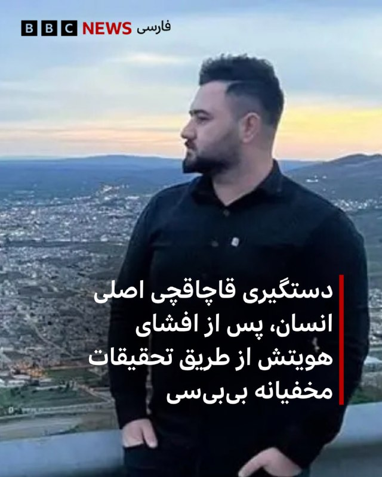

# خواننده تلگرام

<!-- TOP_NAV START -->

<a href="https://github.com/ProAlit/aio-downloader/blob/main/telegram/content/archive_1.md" style="display:inline-block; padding:6px 12px; margin:0 4px; background-color:#2ea44f; color:white; text-decoration:none; border-radius:4px; font-weight:bold;">صفحه بعد</a>

<!-- TOP_NAV END -->

<!-- MSG START -->

---
📅 بروزرسانی: 1405/02/30 16:34
---

## VahidOOnLine — post 241136

  

رسانه‌های حقوق بشری گزارش دادند دادگاه کیفری تهران پس از رسیدگی دوباره به پرونده شهرک اکباتان، سه معترض بازداشت‌شده در این پرونده را به دیه و پنج سال حبس محکوم و سه معترض دیگر را از اتهام مشارکت در «قتل عمد» تبرئه کرد. حکم اعدام این شش تن پیش‌تر در دیوان عالی کشور نقض شده بود.

سایت هرانا چهارشنبه ۳۰ اردیبهشت گزارش داد شعبه ۱۳ دادگاه کیفری یک استان تهران، میلاد آرمون، علیرضا کفایی و امیرمحمد خوش‌اقبال را بابت اتهام «مشارکت در قتل عمد» آرمان علی‌وردی، از نیروهای بسیج، محکوم کرد. هر یک از آن‌ها به پرداخت سهم مساوی از دیه کامل یک انسان و پنج سال حبس محکوم شده‌اند.

طبق گزارش هرانا، نوید نجاران، حسین نعمتی و علیرضا برمرزپورناک، سه متهم دیگر این پرونده، به دلیل «فقدان مدارک دال بر وارد کردن ضربه به ناحیه مشخصی از بدن علی‌وردی» از اتهام مشارکت در قتل عمد تبرئه شدند.

این حکم ۱۵ بهمن سال گذشته صادر و سه‌شنبه ۲۹ اردیبهشت به وکلای این افراد ابلاغ شده است.

این شش شهروند معترض در آبان ۱۴۰۳ از سوی همین شعبه به اعدام محکوم شده بودند.
‌🏁 🇬🇧 IranintlTV

🤖 @VahidOOnLine

## WithYashar — post 11751

  <a href="telegram/content/WithYashar_11751_1779282276.mp4" target="_blank">🎬 Download video</a>

تنها فیلم موجود از جعفر شفیع زاده

«در پشت پرده های انقلاب» عنوان کتاب خاطرات جعفر شفيع زاد، بچه قصاب قهدری‌جانی است که نخستین بار در سال ۲۰۰۰ در آلمان منتشر شد.

او یکی از اعضای بادی گارد خمينی بود که در سال ۵۶ در سوريه بدستور قطب زاده؛ ابراهيم يزدی؛ بنی صدر و.... دوره آموزش نظامی مخصوص و چريکی گذرانده و از زندان اصفهان و روستای قهدريجان به فرانسه و دمشق و ليبی (طرابلس) فرستاده میشود.

برای اندکی ممکن است که سبک نگارش خاطرات شفیع زاده در کتاب «در پشت پرده های انقلاب» به صورت مستند نباشد و یا اینکه اسم افراد و یا مکانها بنا بر ملاحظاتی با آنچه که واقعا اتفاق افتاده باشد دقیقا همخوانی نداشته باشد. اما تجربیات، مدارک موجود و اطلاعاتی که بعد از انتشار این کتاب به دست آمد نشان داد که همه مطالب بیان شده در این کتاب بخصوص دخالت کشورها در به پایان رساندن انقلاب ۵۷ و دستنشاندگی محافل اسلامی و رایطه شخص خمینی، کاملا واقعی است.
@withyashar

## IranIntlTV — post 338075

  <a href="telegram/content/IranIntlTV_338075_1779282279.mp4" target="_blank">🎬 Download video</a>

پس از ماه‌ها بی‌خبری از وضعیت رشید مظاهری، دروازه‌بان پیشین تیم فوتبال ایران، قوه قضاییه بازداشت او را تایید کرد. مظاهری پس از کشتار معترضان در دی‌ماه، با انتشار ویدیویی علی خامنه‌ای را «شیطان» توصیف کرده بود.
گفت‌وگو با رها پوربخش، عضو تحریریه ایران‌اینترنشنال
@iranintltv

## IranIntlTV — post 338074

  <a href="telegram/content/IranIntlTV_338074_1779282281.mp4" target="_blank">🎬 Download video</a>

بازداشت پسر معصومه ابتکار و اعضای خانواده او توسط اداره مهاجرت آمریکا، در روزهای اخیر به یکی از موضوعات پربحث در شبکه‌های اجتماعی تبدیل شده است. پس از انتشار اظهارات عروس خانواده به آسوشیتدپرس درباره تلاش برای داشتن «یک زندگی عادی»، بسیاری از کاربران به تناقض میان سبک زندگی خانواده مقام‌های جمهوری اسلامی در خارج از کشور واکنش نشان داده‌اند.
عادله بورنگ، عضو تحریریه ایران‌اینترنشنال، از واکنش کاربران می‌گوید
@iranintltv

## IranIntlTV — post 338073

  

رسانه‌های حقوق بشری گزارش دادند دادگاه کیفری تهران پس از رسیدگی دوباره به پرونده شهرک اکباتان، سه معترض بازداشت‌شده در این پرونده را به دیه و پنج سال حبس محکوم و سه معترض دیگر را از اتهام مشارکت در «قتل عمد» تبرئه کرد. حکم اعدام این شش تن پیش‌تر در دیوان عالی کشور نقض شده بود.

سایت هرانا چهارشنبه ۳۰ اردیبهشت گزارش داد شعبه ۱۳ دادگاه کیفری یک استان تهران، میلاد آرمون، علیرضا کفایی و امیرمحمد خوش‌اقبال را بابت اتهام «مشارکت در قتل عمد» آرمان علی‌وردی، از نیروهای بسیج، محکوم کرد. هر یک از آن‌ها به پرداخت سهم مساوی از دیه کامل یک انسان و پنج سال حبس محکوم شده‌اند.

طبق گزارش هرانا، نوید نجاران، حسین نعمتی و علیرضا برمرزپورناک، سه متهم دیگر این پرونده، به دلیل «فقدان مدارک دال بر وارد کردن ضربه به ناحیه مشخصی از بدن علی‌وردی» از اتهام مشارکت در قتل عمد تبرئه شدند.

این حکم ۱۵ بهمن سال گذشته صادر و سه‌شنبه ۲۹ اردیبهشت به وکلای این افراد ابلاغ شده است.

این شش شهروند معترض در آبان ۱۴۰۳ از سوی همین شعبه به اعدام محکوم شده بودند.
https://iranintl.com/202605201945

## FarsiVOA — post 218218

  <a href="telegram/content/FarsiVOA_218218_1779282284.mp4" target="_blank">🎬 Download video</a>

ارتش اسرائیل با انتشار این ویدیو اعلام کرد شب گذشته یک انبار تسلیحات متعلق به حماس را در مرکز نوار غزه منهدم کرد. به گفته ارتش اسرائیل این تسلیحات علیه نیروهای فعال ارتش در نزدیکی خط زرد و شهروندان اسرائیل استفاده می‌شدند.

## DW_Farsi — post 124926

🎥 روغن‌های مصرف‌شده؛ راه‌حل جدید برای بحران سوخت جهانی؟
 
با افزایش قیمت نفت خام در پی تنش‌های خاورمیانه، سوخت‌های زیستی تجدیدپذیر بیش از پیش مورد توجه قرار گرفته‌اند. روغن‌های پخت‌وپز مصرف‌شده و دیگر منابع تجدیدپذیر حالا به‌عنوان گزینه‌ای جایگزین مطرح هستند؛ اما به نظر می‌رسد که چشم‌انداز این صنعت به روند قیمت نفت و سیاست‌های انرژی دولت‌ها  وابسته باشد.
@dw_farsi

## BBCPersian — post 281612

  

🖊بن میلن, بی‌بی‌سی

یک قاچاقچی رده‌بالا که در تحقیقات مخفی بی‌بی‌سی درمورد قاچاق انسان به بریتانیا شناسایی شده بود، در کردستان عراق دستگیر شد.

شبکه‌ای که کاردو جاف با نام مستعار «کاردو رانیه» اداره می‌کرده است، گمان می‌رود که در سال‌های اخیر هزاران مهاجر غیرقانونی را با قایق‌های کوچک از طریق کانال مانش به بریتانیا منتقل کرده باشد.

کاردو جاف از سوی ماموران آژانس امنیت منطقه‌ای اقلیم کردستان در عراق به ظن جرایم قاچاق انسان دستگیر شد؛ او اکنون در بازداشت است و تحقیقات همچنان ادامه دارد.

این مرد ۲۸ ساله که کرد عراقی است، چندین سال با نام‌های مستعار مختلف فعالیت می‌کرد. آقای جاف با مخفی نگه داشتن نام واقعی خود، صدور حکم بازداشت بین‌المللی را برای سازمان‌های اجرای قانون دشوارتر کرده بود.

هفته گذشته، نام واقعی او توسط گزارشگران بی‌بی‌سی، سو میچل و راب لاوری، فاش شد و روایت تعقیب این قاچاقچی در پاکست برنامه رادیو ۴ بی‌بی‌سی منتشر شد.

برای خواندن مطلب کامل به لینک موجود زیر مراجعه کنید:

https://bbc.in/4nGMQrg
📷BBC
@BBCPersian

## alonews — post 121307

🚨 تخفیف خفن فلش‌نت فقط به مدت ۵ ساعت! 
⏰ از همین الان تا ۵ ساعت آینده، تمام سرویس‌های ربات با قیمت ویژه هر گیگ فقط ۹۰ هزار تومان ارائه می‌شوند. 
🎉 هدیه ویژه به مناسبت رسیدن خانواده فلش‌نت به ۲۲۵ هزار نفر 
💎 ۵ گیگابایت — ۶۵۰ هزار تومان 
💎 ۱۰ گیگابایت — ۹۰۰…

## alonews — post 121306

🚨 تخفیف خفن فلش‌نت فقط به مدت ۵ ساعت!

⏰ از همین الان تا ۵ ساعت آینده،
تمام سرویس‌های ربات با قیمت ویژه هر گیگ فقط ۹۰ هزار تومان ارائه می‌شوند.

🎉 هدیه ویژه به مناسبت رسیدن خانواده فلش‌نت به ۲۲۵ هزار نفر

💎 ۵ گیگابایت — ۶۵۰ هزار تومان

💎 ۱۰ گیگابایت — ۹۰۰ هزار تومان

💎 ۵۰ گیگابایت — ۴ میلیون و ۵۰۰ هزار تومان

⚡️ فرصت محدود و تعداد سرویس‌ها محدود است.

🤖 همین حالا از طریق ربات فلش‌نت خرید خود را انجام دهید قبل از اینکه تخفیف به پایان برسد!

🙏 تیم فلش نت

@Flashnetofferbot

## alonews — post 121305

  <a href="telegram/content/alonews_121305_1779282288.webm" target="_blank">🎬 Download video</a>

👈مارکو روبیو، وزیر خارجه آمریکا، رفت رو مخ حکومت کوبا و گفت وقتشه یه فصل جدید با مردم کوبا شروع بشه

✅ @AloNews خبر جنگ

## alonews — post 121304

  <a href="telegram/content/alonews_121304_1779282288.mp4" target="_blank">🎬 Download video</a>

👈دبیرکل ناتو: روسیه میداند استفاده از سلاح هسته‌ای واکنشی ویرانگر خواهد داشت

🔴مارک روته، دبیرکل ناتو، در پاسخ به سوالی درباره احتمال استفاده روسیه از سلاح هسته‌ای در جنگ اوکراین گفت: «آنها میدانند اگر چنین اتفاقی بیفتد، واکنش ویرانگر خواهد بود.»
روته جزئیات بیشتری درباره نوع واکنش احتمالی ارائه نکرد، اما این اظهارات در ادامه هشدارهای مکرر ناتو و کشورهای غربی درباره پیامدهای استفاده از سلاح هسته‌ای مطرح شده است.

✅ @AloNews خبر جنگ

---
📅 بروزرسانی: 1405/02/30 16:23
---

## VahidOOnLine — post 241135

  

♦️صداوسیمای جمهوری اسلامی روز چهارشنبه ۳۰ اردیبهشت، اعلام کرد که پنج ابرنفتکش پس از انجام هماهنگی‌های لازم با نیروی دریایی سپاه پاسداران، اجازه یافتند از تنگه هرمز عبور کنند.

داده‌های کشتیرانی موسسات کپلر و ال‌اس‌ای‌جی تایید می‌کنند که دو نفتکش عظیم «یوان گوی یانگ» با پرچم چین و «اوشن لیلی» با پرچم هنگ‌کنگ، پس از بیش از دو ماه انتظار در خلیج فارس، سرانجام با حمل ۴ میلیون بشکه نفت خام از این آبراه حیاتی عبور کردند.

هم‌زمان، چو هیون، وزیر امور خارجه کره جنوبی، در یک جلسه پارلمانی در سئول تایید کرد که یک نفتکش متعلق به این کشور نیز روز چهارشنبه در حال عبور از تنگه هرمز بوده است. نفتکش‌های چینی و هنگ‌کنگی محموله‌های نفت خام عراق و قطر را درست در آستانه آغاز درگیری‌ها در اسفندماه بارگیری کرده بودند.
‌🇸🇦 Indypersian

🤖 @VahidOOnLine

## WithYashar — post 11750

  

poshte-pardehaye-enghelab (@withyashar).pdf

## FoxNewsTwitter — post 341982

  <a href="telegram/content/FoxNewsTwitter_341982_1779281627.mp4" target="_blank">🎬 Download video</a>

Fox News (Twitter/X)

NEW: MPD and the FBI are asking the public to help identify the faces behind the viral Chipotle assault in D.C.’s Navy Yard neighborhood.

Authorities say a combined reward of up to $6,000 is now being offered for information leading to arrests and convictions in the case.

## IranIntlTV — post 338072

  <a href="telegram/content/IranIntlTV_338072_1779281630.mp4" target="_blank">🎬 Download video</a>

پاکستان در حالی نقش میانجی میان تهران و واشینگتن را ایفا می‌کند که همکاری‌های نظامی گسترده خود با عربستان سعودی، یکی از رقبای اصلی جمهوری اسلامی، را ادامه داده است. خبرگزاری رویترز گزارش داده اسلام‌آباد یک اسکادران جنگنده جی‌اف-۱۷، دو اسکادران پهپاد نظامی و سامانه‌های پدافند هوایی اچ‌کیو-۹ ساخت چین را به عربستان سعودی اعزام کرده است.
@iranintltv

## RadioFarda — post 157386

  

🔸رسانه‌های ایران روز چهارشنبه ۳۰ اردیبهشت خبر دادند که محسن نقوی، وزیر کشور پاکستان، وارد تهران شده است. او روز ۲۶ اردیبهشت نیز به ایران سفر کرده بود.

🔸خبرگزاری ایسنا اعلام کرده که برنامه و اهداف سفر این مقام ارشد پاکستانی در ایران «مشخص نیست». خبرگزاری تسنیم نیز گزارش داده که آقای نقوی در بدو ورود به تهران با وزیر کشور ایران دیدار کرده است.

🔸وزیر کشور پاکستان در سفر قبلی به تهران که ابتدای این هفته انجام شد، درباره «ازسرگیری مذاکرات» بین ایران و آمریکا با همتای ایرانی خود گفت‌وگو کرد و سپس به دیدار رئیس‌جمهور و رئیس مجلس ایران رفت.

🔸دومین سفر این مقام پاکستانی در حالی انجام می‌شود که دونالد ترامپ، رئیس‌جمهور آمریکا، گفته است یک حمله نظامی برنامه‌ریزی‌شده به اهدافی در ایران برای روز سه‌شنبه را لغو کرده و جی‌دی ونس، معاون او، نیز رروز سه‌شنبه از «پیشرفت زیاد» مذاکرات بین واشینگتن و تهران برای رسیدن به توافق پایان جنگ خبر داد.

🔸ترامپ روز سه‌شنبه تأکید کرد که ایران تنها چند روز برای تصمیم‌گیری درباره توافق وقت دارد و افزود شاید لازم باشد ضربات نظامی دیگری به ایران وارد شود.

@RadioFarda

## alonews — post 121303

  <a href="telegram/content/alonews_121303_1779281633.mp4" target="_blank">🎬 Download video</a>

👈دبیرکل ناتو: وابستگی بیش از حد اروپا به آمریکا پایدار نیست

مارک روته، دبیرکل ناتو، اعلام کرد اروپا به همراه بریتانیا، ترکیه و نروژ بیش از ۵۰۰ میلیون نفر جمعیت دارد، در حالی که روسیه حدود ۱۲۰ تا ۱۴۰ میلیون نفر جمعیت دارد.
او گفت با این حال، اروپا همچنان برای دفاع از خود در برابر روسیه بیش از حد به آمریکا وابسته است؛ کشوری با حدود ۳۵۰ میلیون نفر جمعیت که نقش اصلی در تامین امنیت ناتو را بر عهده دارد.
روته تاکید کرد: «این وضعیت در بلندمدت پایدار نیست.»

تحلیل: اظهارات دبیرکل ناتو در شرایطی مطرح میشود که جنگ اوکراین و احتمال کاهش حضور نظامی آمریکا در اروپا، بحث درباره تقویت توان دفاعی مستقل اروپا را دوباره پررنگ کرده است.

✅ @AloNews خبر جنگ

## alonews — post 121302

  <a href="telegram/content/alonews_121302_1779281636.webm" target="_blank">🎬 Download video</a>

👈بن‌گیور، وزیر امنیت ملی اسرائیل، از فعالان بازداشت‌شده در کاروان جهانی صمود غزه در بندر آشدود بازدید کرد. 
🔴به اسرائیل خوش آمدید، ما اینجا در کنترل هستیم. این همان چیزی است که باید باشد. 
✅ @AloNews خبر جنگ

---
📅 بروزرسانی: 1405/02/30 16:15
---

## VahidOOnLine — post 241134

  <a href="telegram/content/VahidOOnLine_241134_1779281144.mp4" target="_blank">🎬 Download video</a>

⭕️ انفجار خودرو در مرکز مالی منهتن نیویورک

♦️انفجار و آتش‌سوزی یک خودرو در نزدیکی مجسمه مشهور «گاو خشمگین» در منطقه وال‌استریت منهتن نیویورک، باعث ایجاد وحشت و سردرگمی میان شهروندان، گردشگران و کارمندان دفترهای کاری شد.
این حادثه حدود ساعت ۶ عصر به وقت محلی و در یکی از پرترددترین و گردشگری‌ترین نقاط شهر نیویورک رخ داد؛ جایی که مجسمه نمادین «گاو خشمگین» (Charging Bull) به‌عنوان سمبل وال‌استریت و قلب اقتصادی آمریکا شناخته می‌شود و روزانه هزاران نفر از آن بازدید می‌کنند.
بر اساس گزارش‌های اولیه، یک وسیله نقلیه ابتدا دچار آتش‌سوزی شد و سپس انفجاری در محل رخ داد. نیروهای پلیس و امدادی نیویورک بلافاصله در منطقه حاضر شدند و محدوده حادثه را تحت کنترل قرار دادند.
تاکنون مقام‌های آمریکایی جزئیات رسمی درباره علت حادثه، احتمال عمدی بودن آن، میزان خسارت‌ها یا شمار احتمالی تلفات و مجروحان منتشر نکرده‌اند.
‌🇸🇦 Indypersian

🤖 @VahidOOnLine

## FoxNewsTwitter — post 341981

  <a href="telegram/content/FoxNewsTwitter_341981_1779281145.mp4" target="_blank">🎬 Download video</a>

Fox News (Twitter/X)

“He was the absolute best dad in the world.”

The daughter of Amin Abdullah — the hero security guard killed during the deadly shooting at a San Diego mosque — remembers her father through tears as the community mourns the three men killed in the attack.

Police say Abdullah helped lock down the Islamic Center and confronted the shooters, actions authorities believe saved lives with nearly 140 children inside the building at the time.

Investigators are treating the massacre as a hate crime after officials say the teenage suspects arrived heavily armed and left behind extremist writings.

## FarsiVOA — post 218217

برگزاری نشست «آینده ایران: وضعیت و چشم‌انداز ملیت‌ها در ایران» به میزبانی بامبوس چارالامبوس نماینده پارلمان بریتانیا

## IranianMinds — post 20433

🔴منابع شبکه العربیه:

آمریکا به پاکستان اطلاع داده که در مسئله هسته‌ای و تنگه هرمز، هیچ امتیازی نخواهد داد.
منابع افزودند که ایران تضمین‌های آمریکایی برای پایان جنگ را کافی نمی‌داند.

@IranianMinds

## BBCPersian — post 281611

🔻تصویب طرحی که راه برگزاری انتخابات زودهنگام در اسرائیل را هموار می‌کند

در اسرائیل نمایندگان کنست، لایحه‌ای را تصویب کرده‌اند که بر اساس آن پارلمان منحل می‌شود و احتمالا انتخابات سراسری زودتر از موقع برگزار می‌شود.

این لایحه توسط احزاب ائتلاف حاکم راست‌گرا ارائه شده است که می‌گویند بنیامین نتانیاهو، نخست وزیر، را دیگر شریک قابل اعتمادی برای خود نمی‌بینند.

این به معنای برگزاری انتخابات چند هفته زودتر از مهلت ۲۷ اکتبر است، اگرچه تاریخ دقیق آن قرار است در مرحله بعدا مشخص شود.

نظرسنجی‌ها حاکی از آن است که آقای نتانیاهو احتمالا در انتخابات بعدی شکست خواهد خورد.

https://bbc.in/4ulwfeR
@BBCPersian

## BBCPersian — post 281610

  

🔻میزان، خبرگزاری قوه قضائیه ایران گزارش داد که رشید مظاهری، دروازه‌بان پیشین تیم ملی فوتبال ایران، هنگام تلاش برای خروج «غیرقانونی» از کشور بازداشت شده است و ادعای همسر او را مبنی بر «نگهداری‌اش در انفرادی در شرایط خیلی سخت»، تکذیب کرد.

پیش‌تر مریم عبدالهی، همسر آقای مظاهری، در صفحه اینستاگرامش نوشت: «رشید همیشه برای حق ایستاد و هزینه‌ همین ایستادگی را حالا با حبس در انفرادی می‌دهد به زندان مرکزی ارومیه منتقل شده و در سلول انفرادی نگهداری می‌شود.» او همچنین از«جامعه ورزش، رسانه‌ها و مردم وطن‌پرست» خواسته بود که بیشتر از قبل «صدای رشید مظاهری باشند.»

قوه قضائیه ایران، با رد ادعای خانم عبداللهی برای نگهداری رشید مظاهری در انفرادی، می‌گوید که این بازیکن سابق فوتبال در بند عمومی زندان نگهداری می‌شود.

در این گزارش همچنین ادعا شده است که آقای مظاهری «قصد داشته با تغییر چهره و پرداخت رشوه به ماموران مرزبانی از مرز‌های غربی به صورت غیرقانونی از کشور خارج شود که در هنگام خروج بازداشت می‌شود.»
رشید مظاهری بعد از انتشار ویدیویی علی خامنه‌ای را مسئول کشته‌شدن معترضان دی ۱۴۰۴ معرفی کرده بود.

📷Hamshahri
@BBCPersian

## Dirty_Kids — post 389804

کولر آبی بوی امتحان نهایی میده.

@Dirty_Kids 👻

## Dirty_Kids — post 389803

  <a href="telegram/content/Dirty_Kids_389803_1779281148.mp4" target="_blank">🎬 Download video</a>

در سالگرد آنگوزمان شدن شهیدِ خدمت رئیسی بد نیست این ویدئو رو دوباره ببینیم…

راستی کسی از حلقوم رهبری خبری داره؟ اتفاقی براش افتاده؟ 😂

@Dirty_Kids 👻

## Hranews — post 113061

زندان اوین؛ گزارشی از اعتصاب کریگ و لیندزی فورمن، زوج بریتانیایی

❗️
❗️
❗️
❗️
❗️– کریگ فورمن و لیندزی فورمن، دو شهروند بریتانیایی محبوس در زندان اوین، در اعتراض به شرایط نگهداری‌شان در زندان و قطع امکان برقراری تماس تلفنی با خانواده، دست به اعتصاب زده‌اند.

#کریگ_فورمن #لیندزی_فورمن

ادامه مطلب

↘️
@hranews_bot تماس ✉️ - @Hranews کانال هرانا 🆑

## alonews — post 121301

  <a href="telegram/content/alonews_121301_1779281149.webm" target="_blank">🎬 Download video</a>

👈یه خانواده پاکستانی اسم 2 پسر دوقلوی تازه متولدشون رو "علی خامنه‌ای" و "علی لاریجانی" گذاشتن.

✅ @AloNews خبر جنگ

## alonews — post 121300

  <a href="telegram/content/alonews_121300_1779281149.mp4" target="_blank">🎬 Download video</a>

👈حمله به الدویر، لبنان

✅ @AloNews خبر جنگ

## alonews — post 121299

  <a href="telegram/content/alonews_121299_1779281150.mp4" target="_blank">🎬 Download video</a>

🔴تصاویر دیده نشده از شب ۱۸ دی

👑حماسه‌ای که ملت شیر و خورشید رقم زدند

✅@AloNews

## alonews — post 121298

  <a href="telegram/content/alonews_121298_1779281152.webm" target="_blank">🎬 Download video</a>

👈حزب الله تصاوير منتشر کرد که نشان مي دهد يک fpv به يک باتري گنبد آهنين در محل اسرائيلي جلال العالم در مرز حمله کرده است.‌‌

✅ @AloNews خبر جنگ

## alonews — post 121297

  <a href="telegram/content/alonews_121297_1779281152.mp4" target="_blank">🎬 Download video</a>

👈ظریف: ما نیاز به تضمین از قول‌شکنان و پیمان‌شکنان نداریم/ مردم و نیروهای مسلح ما بزرگ‌ترین تضمین برای ما هستند

✅ @AloNews خبر جنگ

## alonews — post 121296

📱لطفا توییتر الونیوز رو دنبال کنین 
🔴پست های انگلیسی در رابطه با جنایت های حکومت به انگلیسی نوشته شده و افراد مهم منشن و هشتگ های مهم قرار داده شده. 
🔴ریپست کنین. مهمترین کمک این روزها جلوگیری از پروپاگاندا حکومت علیه این قتل عام مردم هستش. خونشون نباید پایمال…

## alonews — post 121295

  <a href="telegram/content/alonews_121295_1779281153.webm" target="_blank">🎬 Download video</a>

👈سنتکام: ۹۰ کشتی رو تغییر مسیر دادیم و ۴ کشتی رو غیرفعال کردیم

✅ @AloNews خبر جنگ

---
📅 بروزرسانی: 1405/02/30 16:03
---

## VahidOOnLine — post 241133

  <a href="telegram/content/VahidOOnLine_241133_1779280422.mp4" target="_blank">🎬 Download video</a>

امارات متحده عربی، چند روز پس از حمله پهپادی به نیروگاه هسته‌ای براکه در ابوظبی، از عراق خواست فوراً مانع هرگونه «اقدام خصمانه» از خاک خود شود.
وزارت خارجه امارات در بیانیه‌ای تأکید کرد دولت عراق باید بدون قید و شرط از انجام حملات از خاک این کشور جلوگیری کرده و تهدیدها را سریع و مسئولانه مهار کند.
ابوظبی همچنین از عراق خواست برای حفظ امنیت و ثبات منطقه نقش فعال‌تری ایفا کند و جایگاه خود را به‌عنوان «شریکی مسئول» در منطقه تقویت کند.
‌🏁 🇬🇧 ManotoTV

🤖 @VahidOOnLine

## VahidOOnLine — post 241132

  <a href="telegram/content/VahidOOnLine_241132_1779280423.mp4" target="_blank">🎬 Download video</a>

هم‌زمان با قهرمانی آرسنال، کاربران شبکه‌های اجتماعی از عارف جعفرزاده، هوادار این تیم و از جاویدنام‌های رشت، یاد کردند.

عارف جعفرزاده، اهل رشت، در جریان اعتراضات دی‌ماه ۱۴۰۴ جان باخت. بنیاد عبدالرحمن برومند سن او را ۳۴ سال، محل کشته‌شدن را رشت در استان گیلان و تاریخ جان‌باختن او را ۲۰ دی ۱۴۰۴ ثبت کرده و نحوه کشته‌شدن را «اعدام خودسرانه» عنوان کرده است.

علاقه عارف به آرسنال پیش‌تر نیز مورد توجه کاربران قرار گرفته بود. حالا با قهرمانی این تیم، نام او بار دیگر در شبکه‌های اجتماعی بازتاب یافته و کاربران با انتشار تصویری از مزارش نوشته‌اند: «جا دارد قهرمانی آرسنال را به جاویدنام عارف جعفرزاده تبریک بگوییم.»
‌🏁 🇬🇧 ManotoTV

🤖 @VahidOOnLine

## VahidOOnLine — post 241131

  

سنتکام، فرماندهی مرکزی آمریکا، اعلام کرد از زمان آغاز محاصره دریایی جنوب ایران، تا روز چهارشنبه نیروهای این کشور ۹۰ کشتی را تغییر مسیر داده‌اند. سنتکام نوشت: «چهار کشتی نیز برای تضمین اجرای محاصره دریایی از کار انداخته‌ شده‌اند.»

سنتکام همچنین با انتشار همچنین تصویری از یک بالگرد تهاجمی «ای‌اچ-۱ زد وایپر» متعلق به نیروی تفنگداران دریایی آمریکا منتشر کرد و نوشت که در جریان عملیات این محاصره دریایی، این بالگرد در نزدیکی یک کشتی تجاری در حال عبور از آب‌های منطقه‌ای گشت‌زنی می‌کند.
‌🏁 🇬🇧 IranintlTV

🤖 @VahidOOnLine

## VahidOOnLine — post 241130

  <a href="telegram/content/VahidOOnLine_241130_1779280425.mp4" target="_blank">🎬 Download video</a>

رویترز گزارش داد سه نفتکش غول‌پیکر چینی و کره‌جنوبی حامل حدود ۶ میلیون بشکه نفت خاورمیانه، پس از بیش از دو ماه توقف در خلیج فارس، از ۷تنگه هرمز عبور کرده و راهی بازارهای آسیایی شده‌اند.
بر اساس این گزارش، دو نفتکش چینی حامل نفت عراق و قطر و یک نفتکش کره‌جنوبی حامل نفت کویت، از مسیر تعیین‌شده از سوی جمهوری‌اسلامی عبور کرده‌اند.
‌🏁 🇬🇧 ManotoTV

🤖 @VahidOOnLine

## IranIntlTV — post 338071

  

سنتکام، فرماندهی مرکزی آمریکا، اعلام کرد از زمان آغاز محاصره دریایی جنوب ایران، تا روز چهارشنبه نیروهای این کشور ۹۰ کشتی را تغییر مسیر داده‌اند. سنتکام نوشت: «چهار کشتی نیز برای تضمین اجرای محاصره دریایی از کار انداخته‌ شده‌اند.»

سنتکام همچنین با انتشار همچنین تصویری از یک بالگرد تهاجمی «ای‌اچ-۱ زد وایپر» متعلق به نیروی تفنگداران دریایی آمریکا منتشر کرد و نوشت که در جریان عملیات این محاصره دریایی، این بالگرد در نزدیکی یک کشتی تجاری در حال عبور از آب‌های منطقه‌ای گشت‌زنی می‌کند.
https://iranintl.com/202605209458

## Shin_Persian — post 6112

↩️ Quoted tweet: العربية عاجل ✓ @AlArabiya_Brk Wed, 20 May 2026 11:53:13 UTC مصادر العربية: أميركا أبلغت باكستان بأنها لن تقدم تنازلات في المطالب النووية ومضيق هرمز #العربية_عاجل ↩️ Quoted tweet — see the post below for the reply. English Al Arabiya sources:…

## Shin_Persian — post 6111

↩️ Quoted tweet:
العربية عاجل ✓ @AlArabiya_Brk
Wed, 20 May 2026 11:53:13 UTC

مصادر العربية: أميركا أبلغت باكستان بأنها لن تقدم تنازلات في المطالب النووية ومضيق هرمز #العربية_عاجل

↩️ Quoted tweet — see the post below for the reply.

English

Al Arabiya sources: The United States has informed Pakistan that it will not make concessions regarding nuclear demands and the Strait of Hormuz. #AlArabiya_Breaking

𝕏 · @shin_persian

## Shin_Persian — post 6109

  <a href="telegram/content/Shin_Persian_6109_1779280427.mp4" target="_blank">🎬 Download video</a>

ارتش دفاعی اسرائیل | IDF Farsi ✓ @IDFFarsi Wed, 20 May 2026 12:09:36 UTC سخنگوی ارتش اسرائیل: در فاصله چند متری از یک مسجد: ارتش اسرائیل یک سایت تولید تسلیحات متعلق به سازمان تروریستی حزب‌الله را که در ساختمانی با کاربری درمانگاه احداث شده بود، هدف قرار…

## Shin_Persian — post 6108

ارتش دفاعی اسرائیل | IDF Farsi ✓ @IDFFarsi
Wed, 20 May 2026 12:09:36 UTC

سخنگوی ارتش اسرائیل:

در فاصله چند متری از یک مسجد: ارتش اسرائیل یک سایت تولید تسلیحات متعلق به سازمان تروریستی حزب‌الله را که در ساختمانی با کاربری درمانگاه احداث شده بود، هدف قرار داد

نیروهای ارتش اسرائیل پریروز (دوشنبه)، یک سایت تولید تسلیحات متعلق به سازمان تروریستی حزب‌الله را در منطقه صور در جنوب لبنان هدف قرار دادند.

این سایت در ساختمانی که به‌عنوان یک درمانگاه غیرنظامی مورد استفاده قرار می‌گرفت و در فاصله‌ای بسیار نزدیک از یک مسجد قرار داشت، احداث شده بود. پس از حمله، انفجارهای ثانویه در این محل شناسایی شد که نشان‌دهنده وجود تسلیحات در داخل ساختمان است.

سازمان تروریستی حزب‌الله همچنان به فعالیت در مجاورت و از درون زیرساخت‌های غیرنظامی، از جمله اماکن مذهبی و مراکز درمانی ادامه می‌دهد و از آن‌ها به‌صورت سوءاستفاده‌آمیز برای پیشبرد طرح‌های تروریستی علیه شهروندان کشور اسرائیل و نیروهای ارتش اسرائیل بهره می‌برد.

English

IDF (Israel Defense Forces) Spokesperson:

A few meters from a mosque: The IDF targeted a weapons production site belonging to the Hezbollah terrorist organization, which was established in a building used as a clinic.

The day before yesterday (Monday), IDF forces targeted a weapons production site belonging to the Hezbollah terrorist organization in the Tyre region of southern Lebanon.

This site was established in a building used as a civilian clinic, located in very close proximity to a mosque. Following the strike, secondary explosions were identified at the scene, indicating the presence of weapons inside the building.

The Hezbollah terrorist organization continues to operate adjacent to and from within civilian infrastructure, including religious sites and medical centers, exploitatively utilizing them to advance terrorist plots against citizens of the State of Israel and IDF forces.

𝕏 · @shin_persian

## ManotoTV — post 105683

  <a href="telegram/content/ManotoTV_105683_1779280429.mp4" target="_blank">🎬 Download video</a>

امارات متحده عربی، چند روز پس از حمله پهپادی به نیروگاه هسته‌ای براکه در ابوظبی، از عراق خواست فوراً مانع هرگونه «اقدام خصمانه» از خاک خود شود.
وزارت خارجه امارات در بیانیه‌ای تأکید کرد دولت عراق باید بدون قید و شرط از انجام حملات از خاک این کشور جلوگیری کرده و تهدیدها را سریع و مسئولانه مهار کند.
ابوظبی همچنین از عراق خواست برای حفظ امنیت و ثبات منطقه نقش فعال‌تری ایفا کند و جایگاه خود را به‌عنوان «شریکی مسئول» در منطقه تقویت کند.

## ManotoTV — post 105682

  <a href="telegram/content/ManotoTV_105682_1779280430.mp4" target="_blank">🎬 Download video</a>

یکی از مخاطبان منوتو تصویری از یک فروشگاه در ایران فرستاده که در آن روی بطری روغن خوراکی دزدگیر نصب شده است.

این تصویر در حالی ارسال شده که افزایش قیمت کالاهای اساسی، تورم و کاهش قدرت خرید، فشار معیشتی بر خانوارها را بیشتر کرده است.

مخاطبی که این تصویر را فرستاده، نوشته است نصب دزدگیر روی کالایی مانند روغن، نشان می‌دهد گرانی و بحران اقتصادی تا سفره روزمره مردم پیش رفته است.

## ManotoTV — post 105681

  <a href="telegram/content/ManotoTV_105681_1779280431.mp4" target="_blank">🎬 Download video</a>

هم‌زمان با قهرمانی آرسنال، کاربران شبکه‌های اجتماعی از عارف جعفرزاده، هوادار این تیم و از جاویدنام‌های رشت، یاد کردند.

عارف جعفرزاده، اهل رشت، در جریان اعتراضات دی‌ماه ۱۴۰۴ جان باخت. بنیاد عبدالرحمن برومند سن او را ۳۴ سال، محل کشته‌شدن را رشت در استان گیلان و تاریخ جان‌باختن او را ۲۰ دی ۱۴۰۴ ثبت کرده و نحوه کشته‌شدن را «اعدام خودسرانه» عنوان کرده است.

علاقه عارف به آرسنال پیش‌تر نیز مورد توجه کاربران قرار گرفته بود. حالا با قهرمانی این تیم، نام او بار دیگر در شبکه‌های اجتماعی بازتاب یافته و کاربران با انتشار تصویری از مزارش نوشته‌اند: «جا دارد قهرمانی آرسنال را به جاویدنام عارف جعفرزاده تبریک بگوییم.»

## ManotoTV — post 105680

  <a href="telegram/content/ManotoTV_105680_1779280432.mp4" target="_blank">🎬 Download video</a>

رویترز گزارش داد سه نفتکش غول‌پیکر چینی و کره‌جنوبی حامل حدود ۶ میلیون بشکه نفت خاورمیانه، پس از بیش از دو ماه توقف در خلیج فارس، از ۷تنگه هرمز عبور کرده و راهی بازارهای آسیایی شده‌اند.
بر اساس این گزارش، دو نفتکش چینی حامل نفت عراق و قطر و یک نفتکش کره‌جنوبی حامل نفت کویت، از مسیر تعیین‌شده از سوی جمهوری‌اسلامی عبور کرده‌اند.

## FarsiVOA — post 218216

  <a href="telegram/content/FarsiVOA_218216_1779280433.mp4" target="_blank">🎬 Download video</a>

پرسش میدان: ادامه‌ آتش‌بس؟‌جنگ دوباره؟ صلح ناپایدار؟ تعلیقی که بر زندگی مردم در ایران سایه افکنده چه زمان و چگونه به پایان می‌رسد؟‌ آیا چشم‌اندازی برای ثبات هست؟

## DW_Farsi — post 124925

  

🔶 قطع اینترنت در ایران وارد هشتادودومین روز شد؛ انتقاد سرافراز از "مدیریت ضعیف"
 
نت‌بلاکس اعلام کرد قطع اینترنت در ایران اکنون وارد هشتادودومین روز شده و پس از ۱۹۴۴ ساعت، کشور همچنان تا حد زیادی از اینترنت جهانی جدا مانده است.
 
نت‌بلاکس می‌گوید در دورانی که قطع چنددقیقه‌ای اینترنت می‌تواند "بحران" تلقی شود، ایران با ادامه این خاموشی دیجیتال رکوردهای تازه‌ای ثبت کرده است. این نهاد هشدار داده که ادامه این وضعیت، هم معیشت مردم را تخریب می‌کند و هم حقوق شهروندی را بیشتر فرسایش می‌دهد.
 
در همین رابطه، محمد سرافراز، عضو شورای عالی فضای مجازی، به روزنامه "شرق" گفته است که "مشکل اصلی، ساختار ناکارآمد، مدیریت ضعیف و دخالت نهادهای دیگر در شورای عالی فضای مجازی است. او تأکید کرده که تصمیم‌های مربوط به قطع اینترنت در خود این شورا گرفته نشده و کارنامه ۱۵ ساله شورا هم نشان می‌دهد این نهاد نتوانسته در جهت هدف اولیه‌اش، یعنی بهره‌گیری حداکثری از فرصت‌های اینترنت، گام‌های بلندی بردارد."
 
@dw_farsi

## manototv — post 105683

  <a href="telegram/content/manototv_105683_1779280435.mp4" target="_blank">🎬 Download video</a>

امارات متحده عربی، چند روز پس از حمله پهپادی به نیروگاه هسته‌ای براکه در ابوظبی، از عراق خواست فوراً مانع هرگونه «اقدام خصمانه» از خاک خود شود.
وزارت خارجه امارات در بیانیه‌ای تأکید کرد دولت عراق باید بدون قید و شرط از انجام حملات از خاک این کشور جلوگیری کرده و تهدیدها را سریع و مسئولانه مهار کند.
ابوظبی همچنین از عراق خواست برای حفظ امنیت و ثبات منطقه نقش فعال‌تری ایفا کند و جایگاه خود را به‌عنوان «شریکی مسئول» در منطقه تقویت کند.

## manototv — post 105682

  <a href="telegram/content/manototv_105682_1779280436.mp4" target="_blank">🎬 Download video</a>

یکی از مخاطبان منوتو تصویری از یک فروشگاه در ایران فرستاده که در آن روی بطری روغن خوراکی دزدگیر نصب شده است.

این تصویر در حالی ارسال شده که افزایش قیمت کالاهای اساسی، تورم و کاهش قدرت خرید، فشار معیشتی بر خانوارها را بیشتر کرده است.

مخاطبی که این تصویر را فرستاده، نوشته است نصب دزدگیر روی کالایی مانند روغن، نشان می‌دهد گرانی و بحران اقتصادی تا سفره روزمره مردم پیش رفته است.

## manototv — post 105681

  <a href="telegram/content/manototv_105681_1779280437.mp4" target="_blank">🎬 Download video</a>

هم‌زمان با قهرمانی آرسنال، کاربران شبکه‌های اجتماعی از عارف جعفرزاده، هوادار این تیم و از جاویدنام‌های رشت، یاد کردند.

عارف جعفرزاده، اهل رشت، در جریان اعتراضات دی‌ماه ۱۴۰۴ جان باخت. بنیاد عبدالرحمن برومند سن او را ۳۴ سال، محل کشته‌شدن را رشت در استان گیلان و تاریخ جان‌باختن او را ۲۰ دی ۱۴۰۴ ثبت کرده و نحوه کشته‌شدن را «اعدام خودسرانه» عنوان کرده است.

علاقه عارف به آرسنال پیش‌تر نیز مورد توجه کاربران قرار گرفته بود. حالا با قهرمانی این تیم، نام او بار دیگر در شبکه‌های اجتماعی بازتاب یافته و کاربران با انتشار تصویری از مزارش نوشته‌اند: «جا دارد قهرمانی آرسنال را به جاویدنام عارف جعفرزاده تبریک بگوییم.»

## manototv — post 105680

  <a href="telegram/content/manototv_105680_1779280438.mp4" target="_blank">🎬 Download video</a>

رویترز گزارش داد سه نفتکش غول‌پیکر چینی و کره‌جنوبی حامل حدود ۶ میلیون بشکه نفت خاورمیانه، پس از بیش از دو ماه توقف در خلیج فارس، از ۷تنگه هرمز عبور کرده و راهی بازارهای آسیایی شده‌اند.
بر اساس این گزارش، دو نفتکش چینی حامل نفت عراق و قطر و یک نفتکش کره‌جنوبی حامل نفت کویت، از مسیر تعیین‌شده از سوی جمهوری‌اسلامی عبور کرده‌اند.

## alonews — post 121292

  <a href="telegram/content/alonews_121292_1779280439.mp4" target="_blank">🎬 Download video</a>

👈ویدیوهای که داخل رسانه‌ها وایرال شده، یه فرد شبیه چهره علی خامنه‌ای، هست و دست راستش هم آسیب دیده

😂میدونم AI هست ولی دلیلش چیه که دارن اینارو رو نشر میدن؟

✅ @AloNews خبر جنگ

## alonews — post 121291

  <a href="telegram/content/alonews_121291_1779280440.webm" target="_blank">🎬 Download video</a>

👈نیروی دریایی سپاه: ۲۶ کشتی با هماهنگی نیرودریایی سپاه عبور کردند

🔴تردد از تنگه هرمز با کسب مجوز و با هماهنگی نیروی دریایی سپاه درحال انجام است

✅ @AloNews خبر جنگ

<!-- MSG END -->

<!-- NAV START -->

<a href="https://github.com/ProAlit/aio-downloader/blob/main/telegram/content/archive_1.md" style="display:inline-block; padding:6px 12px; margin:0 4px; background-color:#2ea44f; color:white; text-decoration:none; border-radius:4px; font-weight:bold;">صفحه بعد</a>

<!-- NAV END -->
