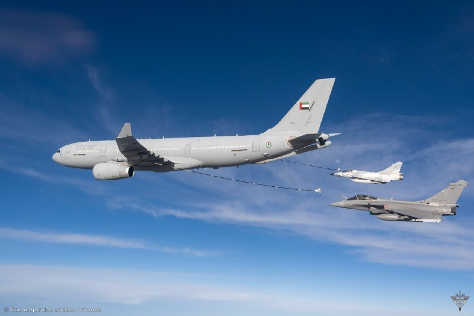

# خواننده تلگرام

<!-- TOP_NAV START -->

<a href="https://github.com/ProAlit/aio-downloader/blob/main/telegram/content/archive_1.md" style="display:inline-block; padding:6px 12px; margin:0 4px; background-color:#2ea44f; color:white; text-decoration:none; border-radius:4px; font-weight:bold;">صفحه بعد</a>

<!-- TOP_NAV END -->

<!-- MSG START -->

---
📅 بروزرسانی: 1405/02/28 20:23
---

## VahidOOnLine — post 240827

  

خبرنگار سی‌ان‌بی‌سی، به نقل از یک مقام آمریکایی در شبکه ایکس نوشت گزارش رسانه‌های ایران مبنی بر این‌که آمریکا در حالی که مذاکرات ادامه دارد با لغو تحریم‌های نفتی موافقت کرده، نادرست است.

پیش‌تر خبرگزاری تسنیم وابسته به سپاه پاسداران، به نقل از یک منبع ناشناس نزدیک به تیم مذاکره‌کننده جمهوری اسلامی گزارش داد که آمریکا با تعلیق تحریم‌های صادرات نفت ایران در طول مذاکرات موافقت کرده است.

این منبع آگاه گفت: «آمریکایی‌ها برخلاف متون پیشین خود، در متن جدید پذیرفته‌اند که در طول دوره مذاکره، تحریم‌های نفتی ایران را ویو (Waive) کنند.»

این خبرگزاری افزود: «"ویو کردن" تحریم‌ها به معنای معافیت یا اسقاط موقت تحریم‌هاست.»
‌🏁 🇬🇧 IranintlTV

🤖 @VahidOOnLine

## WithYashar — post 11562

واشنگتن پست:

اسرائیل منتظر چراغ سبز آمریکا برای شروع عملیات است
@withyashar

## WithYashar — post 11561

آکسیوس: بمب‌ها مذاکره خواهند کرد
@withyashar

## WithYashar — post 11560

یک مقام آمریکایی به سی‌ان‌بی‌سی:

اظهارات رسانه‌های ایرانی مبنی بر موافقت واشنگتن با لغو تحریم‌های نفتی کذب است، هیچ تحریمی لغو نخواهد شد
@withyashar

## mwarmonitor — post 9261

  

🇫🇷🇦🇪نیروی فرانسوی مستقر در امارات متحده عربی تصاویری از یک رزمایش مشترک منتشر کرده است که در آن جنگنده‌های رافال فرانسوی به‌همراه جنگنده‌های میراژ اماراتی و یک هواپیمای سوخت‌رسان شرکت دارند.

@mwarmonitor

## FoxNewsTwitter — post 341878

  <a href="telegram/content/FoxNewsTwitter_341878_1779123208.mp4" target="_blank">🎬 Download video</a>

Fox News (Twitter/X)

A chaotic teen takeover turns violent inside a Washington, D.C. Chipotle.

The group of teens can be seen throwing punches and hurling restaurant chairs and stools at one another as innocent bystanders huddle for safety in a corner of the restaurant.

The incident comes just days after U.S. Attorney Jeanine Pirro vowed to punish parents with jail time or fines for allowing their kids to take part in these mobs.

Chipotle reacting to the violent incident, saying, “We have zero tolerance for guests who behave recklessly in our restaurants and put others at risk.... We are actively supporting local law enforcement in their investigation of the incident.”

## VahidOnline — post 75541

وب‌سایت اکسیوس، روز دوشنبه ۲۸ اردیبهشت ۱۴۰۵ به نقل از یک مقام ارشد آمریکایی و یک منبع آگاه گزارش داد که تهران پیشنهاد تازه‌ای برای توافق ارایه کرده، اما کاخ سفید آن را «پیشرفت معنادار» ندانسته و برای دستیابی به توافق کافی نمی‌داند.

به گفته مقام ارشد آمریکایی، اگر ایران موضع خود را تغییر ندهد، مذاکرات «از طریق بمب‌ها» ادامه خواهد یافت.

بر اساس گزارش اکسیوس، مقام‌های آمریکایی می‌گویند دونالد ترامپ خواهان دستیابی به توافقی برای پایان جنگ است، اما هم‌زمان به دلیل رد بسیاری از خواسته‌های واشنگتن از سوی ایران و خودداری تهران از ارایه امتیازهای قابل‌توجه در برنامه هسته‌ای، گزینه ازسرگیری حملات را نیز بررسی می‌کند.

دو مقام آمریکایی گفته‌اند ترامپ قرار است روز سه‌شنبه نشست تیم ارشد امنیت ملی خود را در اتاق وضعیت کاخ سفید برگزار کند تا گزینه‌های نظامی را بررسی کند.

آکسیوس گزارش داده پیشنهاد تازه ایران که شامگاه یک‌شنبه از طریق میانجی‌گران پاکستانی به آمریکا منتقل شده، تنها تغییرات محدودی نسبت به نسخه قبلی دارد.
بر اساس این گزارش، در پیشنهاد جدید، توضیحات بیشتری درباره تعهد ایران به نساختن سلاح هسته‌ای آمده، اما هیچ تعهد مشخصی درباره توقف غنی‌سازی اورانیوم یا تحویل ذخایر اورانیوم با غنای بالا ارایه نشده است.

در حالی که رسانه‌های دولتی ایران گزارش داده بودند آمریکا در جریان مذاکرات با لغو برخی تحریم‌های نفتی موافقت کرده، مقام آمریکایی به آکسیوس گفته است هیچ کاهش تحریمی «رایگان» و بدون اقدام متقابل از سوی ایران انجام نخواهد شد.

این مقام آمریکایی همچنین گفته است: «ما واقعا پیشرفت زیادی نداشته‌ایم. اکنون در نقطه بسیار حساسی قرار داریم و فشار بر ایران است تا به شکل درستی پاسخ دهد.»

او افزوده است: «زمان آن رسیده که ایرانی‌ها امتیاز واقعی بدهند. ما به گفت‌وگوهای جدی، دقیق و جزیی درباره برنامه هسته‌ای نیاز داریم. اگر این اتفاق رخ ندهد، گفت‌وگو از طریق بمب‌ها انجام خواهد شد و این مایه تاسف است.»

در ادامه این گزارش آمده است که ایران و آمریکا هنوز مذاکرات مستقیم درباره جزییات توافق ندارند و گفت‌وگوها به‌صورت غیرمستقیم برای رسیدن به چارچوبی مشترک ادامه دارد.
این مقام آمریکایی مدعی شده که ارایه پیشنهاد تازه از سوی ایران، با وجود تغییرات اندک، نشان می‌دهد تهران نگران اقدام نظامی بیشتر آمریکا است.
در مقابل، مقام‌های ایرانی همواره تاکید کرده‌اند که این ترامپ است که برای دستیابی به توافق عجله دارد و زمان به سود ایران پیش می‌رود.
@VahidHeadline

📡 @VahidOnline

## IranIntlTV — post 337812

  

خبرنگار سی‌ان‌بی‌سی، به نقل از یک مقام آمریکایی در شبکه ایکس نوشت گزارش رسانه‌های ایران مبنی بر این‌که آمریکا در حالی که مذاکرات ادامه دارد با لغو تحریم‌های نفتی موافقت کرده، نادرست است.

پیش‌تر خبرگزاری تسنیم وابسته به سپاه پاسداران، به نقل از یک منبع ناشناس نزدیک به تیم مذاکره‌کننده جمهوری اسلامی گزارش داد که آمریکا با تعلیق تحریم‌های صادرات نفت ایران در طول مذاکرات موافقت کرده است.

این منبع آگاه گفت: «آمریکایی‌ها برخلاف متون پیشین خود، در متن جدید پذیرفته‌اند که در طول دوره مذاکره، تحریم‌های نفتی ایران را ویو (Waive) کنند.»

این خبرگزاری افزود: «"ویو کردن" تحریم‌ها به معنای معافیت یا اسقاط موقت تحریم‌هاست.»
https://iranintl.com/202605186046

## FarsiVOA — post 218074

🔺محکومیت گسترده حمله پهپادی به عربستان سعودی از خاک عراق

▪️حمله پهپادی به عربستان سعودی از داخل خاک عراق در شامگاه یکشنبه ۲۷ اردبیهشت، با واکنش‌های گسترده منطقه‌ای رو‌به‌رو شده است و چندین کشور ضمن محکوم کردن این حملات، با عربستان سعودی اعلام همبستگی کرده‌اند.

⬇️ بیشتر بخوانید:

https://ir.voanews.com/a/drones-attack-saudi-arabia-iran-proxy/8151209.html/?nocach=1

## IranianMinds — post 20352

  <a href="telegram/content/IranianMinds_20352_1779123210.mp4" target="_blank">🎬 Download video</a>

🔴افغانی هستی؟
بله.
پس،،،،، ننت😂😂😂

@IranianMinds

## BBCPersian — post 281386

🔻اتحادیه اروپا برخی تحریم‌های سوریه را لغو کرد اما تحریم‌های مرتبط با حکومت اسد را برقرار نگه داشت
اتحادیه اروپا تحریم‌ها علیه افراد و نهادهای مرتبط با حکومت سابق سوریه به رهبری بشار اسد را برای یک سال دیگر تمدید کرد اما همزمان به برخی از تحریم‌های حکومت فعلی سوریه، پایان داد.

رفع تحریم‌ها شامل هفت نهاد سوری است، از جمله وزارتخانه‌های دفاع و کشور.

اتحادیه اروپا اعلام کرده که این تصمیم با هدف تقویت تعامل اتحادیه اروپا با سوریه انجام شده است.

اتحادیه اروپا یک سال پیش تمامی تحریم‌های اقتصادی علیه سوریه را با هدف «حمایت از گذار مسالمت‌آمیز و فراگیر این کشور، بهبود وضعیت اجتماعی-اقتصادی و بازسازی» لغو کرد و تحریم‌های مرتبط با حکومت بشار اسد را برقرار نگه داشت.

اتحادیه اروپا در بیانیه‌ای گفت که «بر این باور است که شبکه‌های وابسته به رژیم پیشین اسد همچنان نفوذ خود را حفظ کرده‌اند و خطر تضعیف روند گذار سیاسی و مانع‌تراشی در مسیر آشتی ملی و پاسخ‌گویی را به همراه دارند.»

اتحادیه اروپا اولین بار در سال ۲۰۱۱ و در واکنش به سرکوب خشونت‌آمیز غیرنظامیان از سوی حکومت اسد، تحریم‌هایی را علیه سوریه اعمال کرده بود.

https://bbc.in/4ukERmj
@BBCPersian

## Dirty_Kids — post 389694

  

به بابات بگو هرکی صحبت از خایه کرد اشکال نداره ولی تو یکی گوه نخور…

@Dirty_Kids 👻

## Dirty_Kids — post 389693

  

چجوری تو هوای روشن پیتزا میخورین؟!
بابا یه سری غذاها مال روشناییه یه سریاش مال تاریکی.

@Dirty_Kids 👻

## Dirty_Kids — post 389692

  <a href="telegram/content/Dirty_Kids_389692_1779123212.mp4" target="_blank">🎬 Download video</a>

انتقاد تند همشهری به سریال «تهران کنارت»

بچه جون بزرگترات مجوز دادن چون اوضاع‌ خیته، اسکل تو خیابون مجوز عرقخوری هم دادن به پرستوهاتون:))))

به خودتم مجوز دادن که بیای انتقاد کنی که مثلا قشر خرمذهبی رو راضی کنی و همچنین این فیلم‌رو وایرال کنی ذهن‌هارو منحرف کنی از فلاکت مملکت

ولی این وسط توئیت سوگند عالی بود، ندیده بودم

@Dirty_Kids 👻

## Dirty_Kids — post 389691

✖️ سایت بین المللی bet120x 
✖️  
👍دارای مجوز رسمی Gambling Judge سوئد
👍       
💳شارژ حساب از طریق ارز و یووچر و پرمیوم ووچر 
💳تسویه حساب دلاری سریع 💊بیمه شرط میکس 
⚠️فروش شرط 
🔔ویرایش شرط                    
3️⃣
2️⃣ 
🎁20%هدیه واریز از طریق ارز و ووچر ┅━━━━━━━━━━━…

## Dirty_Kids — post 389690

  

✖️ سایت بین المللی bet120x 
✖️

 
👍دارای مجوز رسمی Gambling Judge سوئد
👍
     

💳شارژ حساب از طریق ارز و یووچر و پرمیوم ووچر

💳تسویه حساب دلاری سریع
💊بیمه شرط میکس

⚠️فروش شرط

🔔ویرایش شرط                    
3️⃣
2️⃣

🎁20%هدیه واریز از طریق ارز و ووچر
┅━━━━━━━━━━━

🎁 10%برگشت باخت به صورت روزانه

🎁 10%برگشت باخت به صورت هفتگی

🎁10%برگشت باخت به صورت ماهانه

💻ادرس ورود به سایت:
https://bet120x.com/fa/?btag=971470
➖➖➖➖➖
   
👈 آموزش واریز و برداشت دلاری
👉

🔪کانال اطلاع رسانی:
👇

✈️https://t.me/+1Wv5nGY_a54xNzlk

## alonews — post 120915

  <a href="telegram/content/alonews_120915_1779123214.webm" target="_blank">🎬 Download video</a>

👈وزیر خزانه داری آمریکا: مجوز موقت 30 روزه برای خرید نفت روسیه صادر شد

✅ @AloNews خبر جنگ

---
📅 بروزرسانی: 1405/02/28 20:13
---

## VahidOOnLine — post 240826

  

♦️دونالد ترامپ، رئیس‌جمهوری آمریکا، روز دوشنبه ۲۸ اردیبهشت‌ماه، در گفتگو با شبکه العربیه گفت ایالات متحده در حال انجام «کاری بزرگ» است و افزود که «پیروزی در راه است.»

ترامپ جزئیات بیشتری درباره منظور خود ارائه نکرد، اما این اظهارات در حالی مطرح می‌شود که تنش‌ها میان آمریکا و جمهوری اسلامی و مذاکرات مربوط به جنگ و تنگه هرمز ادامه دارد.
‌🇸🇦 Indypersian

🤖 @VahidOOnLine

## VahidOOnLine — post 240825

  

دونالد ترامپ به العربیه گفت: «ما در حال انجام کاری بزرگ هستیم و پیروزی در راه است.»

او پیش‌تر در تروث سوشال نوشت حتی اگر جمهوری اسلامی کاملا تسلیم شود و شکست خود را بپذیرد، رسانه‌هایی مانند نیویورک تایمز، وال‌استریت ژورنال و سی‌ان‌ان آن را پیروزی تهران جلوه خواهند داد.
او افزود رسانه‌های جعلی و دموکرات‌ها «کاملا راه خود را گم کرده‌اند و دیوانه شده‌اند.»

‌🏁 🇬🇧 IranintlTV

🤖 @VahidOOnLine

## WithYashar — post 11559

منابع «العربیه»:

وزیر کشور پاکستان بعد از آخرین تلاش‌هایش، تهران را ترک کرد.
@withyashar

## WithYashar — post 11558

تری یینگست، خبرنگار فاکس نیوز‌ : ما تو آستانه بازگشت به عملیات‌های رزمی تمام‌عیار هستیم
@withyashar

## mwarmonitor — post 9260

🇺🇸وزارت خزانه‌داری آمریکا در حال صدور یک مجوز عمومی موقت ۳۰روزه است تا به آسیب‌پذیرترین کشورها اجازه دهد به‌طور موقت به نفت روسیه‌ای که هم‌اکنون در دریا سرگردان مانده دسترسی پیدا کنند.

🔸این تمدید، انعطاف‌پذیری بیشتری فراهم می‌کند و ما با این کشورها همکاری خواهیم کرد تا در صورت نیاز مجوزهای اختصاصی صادر شود. این مجوز عمومی به تثبیت بازار فیزیکی نفت خام کمک می‌کند و تضمین می‌کند که نفت به دست کشورهایی برسد که بیشترین آسیب‌پذیری انرژی را دارند.

🔸همچنین با کاهش توان چین برای انباشت نفت ارزان‌قیمت، به هدایت مجدد عرضه موجود به کشورهایی که بیشترین نیاز را دارند کمک خواهد کرد.

@mwarmonitor

## mwarmonitor — post 9259

📝 دیدن این تصاویر تهوع‌آور بر فراز برج‌های تهران، آن هم در کشوری که توده‌ی مردمش زیر خط فقر مطلق برای یک تکه نان شب سگ‌دو می‌زنند، هیچ چیز جز یک وقاحت آشکار و سادیسم اجتماعی نیست. این لاشخورهای مرفهی که به لطف رانت و وابستگی، جیب‌هایشان از پول این ملت مغبون…

## pm_afshaa — post 90968

🔴العربیه: وزیر کشور پاکستان بعد از رد آخرین پیشنهاد ایران توسط آمریکا، دقایقی پیش ایران رو ترک کرد

💧 Rainbet.com the #1 Non-KYC Crypto Casino & Sportsbook @rainbetcom

😁 @Pm_Afshaa

## DEJradio — post 4708

  <a href="telegram/content/DEJradio_4708_1779122638.webm" target="_blank">🎬 Download video</a>

🔺🎤 خشم سیاسی و مرگ روابط

گفت‌وگو با دکتر مصطفی میررمضانی

#خشم_سیاسی #حکومت_آخوندی
@DEJradio

## VahidOnline — post 75540

  

پست ترامپ، ترجمه ماشین:
اگر ایران تسلیم شود، اعتراف کند که نیروی دریایی‌اش از بین رفته و در قعر دریا آرمیده است، و نیروی هوایی‌اش دیگر در میان ما نیست، و اگر تمام ارتشش از تهران خارج شود، سلاح‌ها را زمین بیندازد و دست‌ها را بالا بگیرد، هرکدام فریاد بزنند «تسلیمم، تسلیمم» و در حالی‌ که پرچم سفیدِ نمادین را دیوانه‌وار تکان می‌دهند، و اگر تمام رهبران باقی‌مانده‌اش همه «اسناد تسلیم» لازم را امضا کنند و شکست خود را در برابر قدرت و نیروی عظیم ایالات متحده باشکوه آمریکا بپذیرند، نیویورک تایمزِ رو به افول، چاینا استریت ژورنال (وال‌استریت ژورنال!)، سی‌ان‌انِ فاسد و اکنون بی‌اهمیت، و همه دیگر اعضای رسانه‌های اخبار جعلی، تیتر خواهند زد که ایران پیروزی‌ای استادانه و درخشان بر ایالات متحده آمریکا به دست آورد و حتی رقابت نزدیکی هم نبود.

دموکرات‌های احمق و رسانه‌ها کاملاً راه خود را گم کرده‌اند. آن‌ها کاملاً دیوانه شده‌اند!!!

پرزیدنت دونالد جی ترامپ
realDonaldTrump

📡 @VahidOnline

## IranIntlTV — post 337811

  <a href="telegram/content/IranIntlTV_337811_1779122639.mp4" target="_blank">🎬 Download video</a>

تیتر اول با نیوشا صارمی، دوشنبه ۲۸ اردیبهشت
@iranintltv

## IranIntlTV — post 337810

  

دونالد ترامپ به العربیه گفت: «ما در حال انجام کاری بزرگ هستیم و پیروزی در راه است.»

او پیش‌تر در تروث سوشال نوشت حتی اگر جمهوری اسلامی کاملا تسلیم شود و شکست خود را بپذیرد، رسانه‌هایی مانند نیویورک تایمز، وال‌استریت ژورنال و سی‌ان‌ان آن را پیروزی تهران جلوه خواهند داد.
او افزود رسانه‌های جعلی و دموکرات‌ها «کاملا راه خود را گم کرده‌اند و دیوانه شده‌اند.»

https://iranintl.com/202605180267

## DW_Farsi — post 124849

  

🔶 تعلیق تحریم‌های نفتی ایران در جریان مذاکرات؟ ادعای تسنیم، تکذیب آکسیوس

خبرگزاری تسنیم، نزدیک به سپاه پاسداران، به نقل از یک منبع نزدیک به تیم مذاکره‌کننده ایران مدعی شد که "آمریکا در متن جدید خود اسقاط تحریم‌های نفتی ایران را پذیرفته است".

بنا بر این خبر، "آمریکایی‌ها برخلاف متون پیشین خود، در متن جدید پذیرفته‌اند که در طول دوره مذاکره، تحریم‌های نفتی ایران را Waive کنند". "ویو" کردن تحریم‌ها به معنای معافیت یا اسقاط موقت تحریم‌هاست.

ایران تاکید دارد که لغو همه‌ تحریم‌های ایران باید جزو تعهدات آمریکا باشد. آمریکا اما اسقاطی اوفک را تا زمان تفاهم نهایی مطرح کرده است.

منبع مورد استناد تسنیم همچنین گفته است که "با وجود برخی وعده‌ها، اختلاف درباره بازگشت پول‌های بلوکه شده وجود دارد".

در همین رابطه خبرگزاری رویترز به نقل از یک منبع ایرانی خبر داد که ایالات متحده در مذاکرات جاری، از جمله در مورد بحث هسته‌ای، انعطاف‌ پذیری نشان داده است.

@dw_farsi

## Persian_Trend_Official — post 14424

❤️ اگر از مخاطبان پرشین ترند هستید و تلگرام پرمیوم دارید،
با بوست کردن کانال کمک بزرگی به رشد و دیده‌شدن بیشتر پرشین ترند می‌کنید.
این بوست‌ها باعث می‌شود امکانات بیشتری برای انتشار محتوا، استوری و قابلیت‌های ویژه کانال فعال شود و در شرایط فعلی، به ادامه پوشش سریع و تحلیل‌های روزانه کمک زیادی می‌کند.
🙏 اگر مایل بودید، از طریق لینک زیر کانال را بوست کنید:
https://t.me/boost/persian_trend_official
📌 @persian_trend_official
پرشین ترند | متفاوت‌ترین کانال نظامی

## RadioFarda — post 157318

  <a href="https://t.me/radiofarda/157318" target="_blank">📎 Download file</a>

📻بشنوید: ایستگاه ۱۹ با رادیوفردا، ۲۸ اردیبهشت ۱۴۰۵

@RadioFarda

## IranianMinds — post 20350

🔴 العربیه: وزیر کشور پاکستان بعد از رد آخرین پیشنهاد ایران توسط آمریکا، دقایقی پیش ایران رو ترک کرد!

@IranianMinds

## alonews — post 120914

  <a href="telegram/content/alonews_120914_1779122643.webm" target="_blank">🎬 Download video</a>

👈آکسیوس: بمب‌ها مذاکره خواهند کرد

✅ @AloNews خبر جنگ

## alonews — post 120913

  <a href="telegram/content/alonews_120913_1779122644.webm" target="_blank">🎬 Download video</a>

👈جلسه کابینه امنیتی اسرائیل، با نتانیاهو دقایقی پیش شروع شد

✅ @AloNews خبر جنگ

---
📅 بروزرسانی: 1405/02/28 20:03
---

## WithYashar — post 11557

رسانه های عبری:

ترامپ‌ امشب دستور بمباران را صادر میکند
@withyashar

## pm_afshaa — post 90967

  

یینگست، خبرنگار فاکس‌ نیوز: ما تو آستانه بازگشت به عملیات‌های رزمی تمام‌عیار هستیم

💧 Rainbet.com the #1 Non-KYC Crypto Casino & Sportsbook @rainbetcom

😁 @Pm_Afshaa

## pm_afshaa — post 90966

⭕️رسانه های عبری : ترامپ‌ امشب دستور بمباران را صادر میکند

💧 Rainbet.com the #1 Non-KYC Crypto Casino & Sportsbook @rainbetcom

😁 @Pm_Afshaa

## DEJradio — post 4707

  <a href="telegram/content/DEJradio_4707_1779122002.webm" target="_blank">🎬 Download video</a>

👑
🔺 شاهزاده رضا پهلوی: «فرض کنید همین نمونه سیلیکون ولی را بشود در بلوچستان پیاده کرد. چرا که نه!»

نشست آینده تکنولوژی در ایران
سان‌فرانسیسکو، ۲۶ اردیبهشت ۲۵۸۵/۱۴۰۵

#شاهزاده_رضا_پهلوی #سیستان_بلوچستان

@DEJradio

## kianmeli1 — post 87465

🔴ترامپ در مورد ایران به «العربیه»: کار با عظمتی انجام می‌دهیم و پیروزی پیش روی ما است.
https://t.me/kianmeli1

## FarsiVOA — post 218073

  <a href="telegram/content/FarsiVOA_218073_1779122002.mp4" target="_blank">🎬 Download video</a>

در روزهای اخیر در چند برنامه زنده صداوسیمای جمهوری اسلامی، استفاده از ابزار جنگی آموزش داده شد و مجریان با در دست گرفتن اسلحه ظاهر شدند.

این بار مجری مسلح و کارشناس برنامه به تصاویر بنیامین نتانیاهو و دونالد ترامپ تیراندازی کردند.

این تصاویر، واکنش‌های گسترده‌ای را درباره عادی‌سازی خشونت و ترویج فضای امنیتی در ایران برانگیخته است.

## Persian_Trend_Official — post 14423

  <a href="telegram/content/Persian_Trend_Official_14423_1779122004.webm" target="_blank">🎬 Download video</a>

🇮🇷ایران از شرکت‌های بزرگ فناوری آمریکا از جمله گوگل، مایکروسافت، متا و آمازون درخواست دریافت هزینه مجوز برای «کابل‌های اینترنت زیرآبی» واقع در تنگه هرمز و خلیج فارس کرده است.

🐣
🪙
🛒
🖥
🖥

🇮🇷سپاه پاسداران تهدید کرده است که در صورت عدم رعایت مقررات محلی توسط این شرکت‌ها، ترافیک را محدود خواهد کرد که ممکن است «اتصال داده‌ها بین اروپا، آسیا و خاورمیانه را مختل کند».

کابل‌های عبوری از تنگه هرمز و دریای سرخ ۱۷٪ از ترافیک جهانی را حمل می‌کنند.

🦁Phantom
🦁

🌏@persian_trend_official
پرشین ترند | متفاوت‌ترین کانال نظامی

## Dirty_Kids — post 389689

  <a href="telegram/content/Dirty_Kids_389689_1779122004.mp4" target="_blank">🎬 Download video</a>

حکومتی‌ها پرچم مبارزه با امریکا رو بلند میکنن ولی تا خشتک امریکایی هستن و کمک به اقتصاد امریکا میکنن

@Dirty_Kids 👻

## Dirty_Kids — post 389688

  

شورتش کو :))))))
#تراپی

@Dirty_Kids 👻

## Dirty_Kids — post 389687

  

🌪وقتی اینترنت طوفانیه... کافیه بادبان ها رو بکشی تا

⚫️با بالاترین کیفیت ممکن
⚡️ 

⚫️100 هزار تومان شارژ هدیه 
🎁

⚫️پایین ترین قیمت گیگی 250
🌐 

⚫️و ارائه پورسانت %10 در ازای هر معرفی
💼

بتونی یه اتصال پایدار با پشتیبانی 24 ساعته داشته باشی
🚀

بادبان راهتو باز می‌کنه
⛵️

G28

🛡@BadBan_VPN | کانال 

🤖@BadBan_VPNBot | ربات 

📞@BadBan_VPNSupport | پشتیبانی

## alonews — post 120912

  <a href="telegram/content/alonews_120912_1779122007.webm" target="_blank">🎬 Download video</a>

👈تری یینگست، خبرنگار فاکس‌ :
- ما تو آستانه بازگشت به عملیات‌های رزمی تمام‌عیار هستیم

✅ @AloNews خبر جنگ

## alonews — post 120911

  <a href="telegram/content/alonews_120911_1779122007.webm" target="_blank">🎬 Download video</a>

👈وزیر کشور پاکستان که در سفری دو روزه برای آخرین میانجیگری میان ایران و آمریکا به تهران سفر کرده بود، پس از رد آخرین پیشنهاد ایران توسط آمریکا، دقایقی پیش تهران را ترک کرد.

✅ @AloNews خبر جنگ

## alonews — post 120910

  <a href="telegram/content/alonews_120910_1779122007.webm" target="_blank">🎬 Download video</a>

🔴فوری / کاخ سفید: آخرین پیشنهاد ایران که امروز ارائه شد نیز به دلیل ناکافی‌ بودن به صورت کامل رد شد، دیگر بمب ها مذاکره خواهند کرد

✅ @AloNews خبر جنگ

---
📅 بروزرسانی: 1405/02/28 19:53
---

## VahidOOnLine — post 240824

  

سازمان عملیات تجارت دریایی بریتانیا اعلام کرد که در روزهای ۲۶ و ۲۷ اردیبهشت هیچ حادثه‌ای در خلیج فارس و دریای عمان گزارش نشده است.

با این حال، وضعیت امنیتی منطقه همچنان ناپایدار است و تهدید علیه کشتیرانی تجاری ادامه دارد.
‌🏁 🇬🇧 IranintlTV

🤖 @VahidOOnLine

## mwarmonitor — post 9258

  <a href="telegram/content/mwarmonitor_9258_1779121406.mp4" target="_blank">🎬 Download video</a>

📝 دیدن این تصاویر تهوع‌آور بر فراز برج‌های تهران، آن هم در کشوری که توده‌ی مردمش زیر خط فقر مطلق برای یک تکه نان شب سگ‌دو می‌زنند، هیچ چیز جز یک وقاحت آشکار و سادیسم اجتماعی نیست. این لاشخورهای مرفهی که به لطف رانت و وابستگی، جیب‌هایشان از پول این ملت مغبون پر شده، با فیلترشکن‌های نجومی و اکانت‌های پرو که هزینه‌اش دستمزد ماهانه‌ی یک کارگر است، سیرکِ رذالت و بی‌عاری خود را به نمایش می‌گذارند تا عقده‌های حقارتشان را با لایک‌های مجازی تسکین دهند.

🔸ورزش کردن و شاد بودن بهانه‌ی کثیفی است برای توجیه این بی‌شرفی مفرط؛ این تصاویر، استوری کردنِ صلح و آرامش نیست، رسماً تف کردن به صورت مردمی است که زیر بار تورم کمرشان شکسته است. جامعه‌ی ما امروز از چند سو مورد هجوم این جانوران قرار گرفته است: یک طرف آن ارزشی‌های جیره‌خوار با پرچم‌گردانی و عربده‌کشی‌های شبانه، طرف دیگر تفنگ‌به‌دستانِ رسانه‌ای که بذر وحشت می‌کارند، و در این میان، این روسپی‌های مدرنِ حکومتی که با بی‌شرمیِ تمام روی زخم مردم نمک می‌پاشند.

@mwarmonitor

## pm_afshaa — post 90965

یه حسی بهم میگه امشب میزننن...

## mamlekate — post 103554

📝 ۲۸ اردیبهشت؛ روز خیام؛
فیلسوف، دانشمند و شاعری که خرد و آزادی را ستود

@mamlekate

## IranIntlTV — post 337809

  

سازمان عملیات تجارت دریایی بریتانیا اعلام کرد که در روزهای ۲۶ و ۲۷ اردیبهشت هیچ حادثه‌ای در خلیج فارس و دریای عمان گزارش نشده است.

با این حال، وضعیت امنیتی منطقه همچنان ناپایدار است و تهدید علیه کشتیرانی تجاری ادامه دارد.
https://iranintl.com/202605183328

## IranIntlTV — post 337808

  <a href="telegram/content/IranIntlTV_337808_1779121408.mp4" target="_blank">🎬 Download video</a>

صبح دوشنبه مسعود پزشکیان گفت در پی محاصره دریایی از سوی آمریکا، صادرات نفت ایران متوقف شده است. ساعتی پس از انتشار این اظهارات، رسانه‌های دولتی از جمله ایرنا اقدام به حذف صحبت‌های پزشکیان از خروجی خود کردند.

گفت‌وگو با جمشید برزگر، روزنامه‌نگار و تحلیل‌گر سیاسی
@iranintltv

## FarsiVOA — post 218072

در گفت‌وگو با حسن هاشمیان، همکار صدای آمریکا، به روند خلع سلاح شدن برخی گروه‌های شبه‌نظامی وابسته به رژیم ایران پرداختیم.

## FarsiVOA — post 218071

🔺جمهوری اسلامی در مقابل مردم ایران؛ سرکوب و برخورد با مخالفان در دستورکار روزانه قوه قضائیه

▪️جمهوری اسلامی که در ماه‌های گذشته و به ویژه پس از اعتراضات دی و عملیات نظامی آمریکا و اسرائیل علیه رژیم، سرکوب را شدت بخشیده است، همه روزه احکام تازه‌ای را علیه مخالفان خود صادر می‌کند.

⬇️ بیشتر بخوانید:

https://ir.voanews.com/a/iran-protests-jale-mohseni-ejei-rules/8150913.html/?nocach=1

## RadioFarda — post 157317

سامانه‌های دفاعی عراق «هیچ پهپادی را در مسیر عربستان شناسایی نکردند»

🔸در پی انتشار خبری از ورود سه پهپاد به حریم هوایی عربستان سعودی، وزارت امور خارجه عراق روز دوشنبه اعلام کرد که سامانه‌های دفاعی این کشور هیچ پهپادی را در مسیر عربستان شناسایی و رهگیری نکرده‌اند.

🔸عربستان سعودی روز یکشنبه ۲۷ اردیبهشت اعلام کرد سه پهپاد را که از حریم هوایی عراق وارد این کشور شده بودند، رهگیری و منهدم کرده است.

🔸ترکی مالکی، سخنگوی وزارت دفاع عربستان، گفت این پهپادها روز یکشنبه وارد حریم هوایی عربستان شدند که نیروی دفاعی این کشور موفق به رهگیری و نابودی آن‌ها شد.

🔸سخنگوی وزارت دفاع عربستان تأکید کرد وزارت دفاع این‌ کشور حق پاسخ‌گویی در زمان و مکان مناسب را برای خود محفوظ می‌داند.

🔸در پاسخ به این خبر، دولت عراق می‌گوید روند تحقیق در این باره را آغاز کرده است.

🔸وزارت خارجه عراق هم روز دوشنبه ضمن اشاره به این که هیچ پهپادی در فضای عراق شناسایی نشده از ریاض خواست «اطلاعات مربوطه» را در اختیار بغداد بگذارد تا «از آن برای تضمین تقویت امنیت و ثبات در دو کشور دوست و برادر استفاده شود».

@RadioFarda

## IranianMinds — post 20349

🔴ترامپ به العربیه:

کار با عظمتی انجام می‌دهیم و پیروزی پیش روی ما است.

@IranianMinds

## BBCPersian — post 281385

  

🔻استاندار خراسان جنوبی از افزایش شدید میزان واردات از افغانستان به ایران از زمان آغاز جنگ آمریکا و اسرائیل با ایران خبر داد.

به گزارش ایرنا، محمدرضا هاشمی گفت که از ابتدای جنگ اخیر میزان واردات از افغانستان به خراسان جنوبی از مسیر گذرگاه مرزی ماهیرود به فراه «۸۴۶ درصد» و از نظر ارزش دلاری ۴۴۱ درصد افزایش داشته است.

به گزارش بی‌بی‌سی دری، به گفته وزارت صنعت و تجارت حکومت طالبان، «پنبه، پیاز، انجیر، زعفران، نوشابه، گیاه‌های طبی و مواد معدنی» از مهمترین اقلام صادراتی افغانستان به ایران است و در مقابل، «نفت و گاز، مواد ساختمانی، فرش، مواد خوراکی، وسایل الکترونیک و انواع شوینده‌ها» از مهمترین کالاهای صادراتی ایران به افغانستان است.

حسین زارعی،‌ مدیرعامل منطقه ویژه اقتصادی خراسان جنوبی، هم به خبرگزاری ایرنا گفت که خدمات مرزی قبلا تا ساعت ۱۶ انجام می‌شد اما با افزایش حجم مراجعه و فعالیت‌ تجاری،‌ ساعت کار خدمات مرزی به ساعت ۱۰ حتی ۱۱ شب افزایش پیدا کرد و همین باعث افزایش قابل توجه میزان صادرات و واردات شده است.

📷 AFP via Getty Images
https://bbc.in/4uOLJbc
@BBCPersian

## alonews — post 120909

  <a href="telegram/content/alonews_120909_1779121410.webm" target="_blank">🎬 Download video</a>

👈طبق گزارش‌ها، جزیره خارک ایران حداقل ۱۰ روز است که هیچ نفتکشی بارگیری نشده است

✅ @AloNews خبر جنگ

## alonews — post 120908

  <a href="telegram/content/alonews_120908_1779121410.webm" target="_blank">🎬 Download video</a>

👈ترامپ به العربیه : داریم کارو خوب پیش می‌بریم، پیروزی هم تو راهه

✅ @AloNews خبر جنگ

## alonews — post 120907

  <a href="telegram/content/alonews_120907_1779121410.webm" target="_blank">🎬 Download video</a>

👈کیر:به هیچ عنوان استعفا نمیدم

✅ @AloNews خبر جنگ

## alonews — post 120906

  <a href="telegram/content/alonews_120906_1779121410.webm" target="_blank">🎬 Download video</a>

👈وزارت بهداشت لبنان اعلام کرد که از آغاز حمله اسرائیل در ۲ مارس تاکنون، ۳٬۰۲۰ نفر شهید و ۹٬۲۷۳ نفر دیگر زخمی شده‌اند

✅ @AloNews خبر جنگ

---
📅 بروزرسانی: 1405/02/28 19:43
---

## VahidOOnLine — post 240823

  

مستند «تمرین‌هایی برای یک انقلاب» ساخته پگاه آهنگرانی در حاشیه جشنواره فیلم کن، جایزه ویژه هیئت داوران رویداد مستند «گلدن گلوبز» با همکاری بنیاد «آرتمیس رایزینگ» را دریافت کرد؛ رویدادی که با همکاری بخش «کن داکس»، مجله ورایتی و بازار فیلم کن برگزار می‌شود.

این برنامه به مستندهای اجتماعی و سیاسی اختصاص دارد و برگزارکنندگان آن می‌گویند هدفش حمایت از فیلمسازی مستند به‌عنوان ابزاری برای شکل دادن به روایت‌ها و گفت‌وگوهای جهانی است.
‌🏁 🇬🇧 IranintlTV

🤖 @VahidOOnLine

## pm_afshaa — post 90964

  <a href="telegram/content/pm_afshaa_90964_1779120797.webm" target="_blank">🎬 Download video</a>

🔴آکسیوس: آمریکا پیشنهاد امروز ایران رو هم ناکافی دانست و کاملا ردش کرد؛ طبق گفته مقام آمریکایی در نقطه بسیار حساسی هستیم! 
💧 Rainbet.com the #1 Non-KYC Crypto Casino & Sportsbook @rainbetcom 
😁 @Pm_Afshaa

## kianmeli1 — post 87464

🔴طبق گزارش‌ها، جزیره خارک ایران حداقل ۱۰ روز است که هیچ نفتکشی بارگیری نشده است.
https://t.me/kianmeli1

## IranIntlTV — post 337807

  

مستند «تمرین‌هایی برای یک انقلاب» ساخته پگاه آهنگرانی در حاشیه جشنواره فیلم کن، جایزه ویژه هیئت داوران رویداد مستند «گلدن گلوبز» با همکاری بنیاد «آرتمیس رایزینگ» را دریافت کرد؛ رویدادی که با همکاری بخش «کن داکس»، مجله ورایتی و بازار فیلم کن برگزار می‌شود.

این برنامه به مستندهای اجتماعی و سیاسی اختصاص دارد و برگزارکنندگان آن می‌گویند هدفش حمایت از فیلمسازی مستند به‌عنوان ابزاری برای شکل دادن به روایت‌ها و گفت‌وگوهای جهانی است.
https://iranintl.com/202605180953

## IranIntlTV — post 337806

  <a href="telegram/content/IranIntlTV_337806_1779120798.mp4" target="_blank">🎬 Download video</a>

همزمان با ارسال تازه‌ترین پیشنهاد تهران، یک مقام ارشد جمهوری اسلامی به رویترز گفت آمریکا درباره فعالیت‌های هسته‌ای محدود تهران انعطاف نشان داده. اما سی‌ان‌ان خبر داد پنتاگون گزینه‌های نظامی مختلف علیه ایران را روی میز گذاشته و ترامپ سه‌شنبه تصمیم می‌گیرد.
گزارشی از مجتبا پورمحسن
@iranintltv

## FarsiVOA — post 218070

🔺نرگس محمدی از بیمارستان مرخص شد؛ هشدار درباره نیاز به فیزیوتراپی در بیمارستان

▪️بنیاد نرگس روز دوشنبه ۲۸ اردیبهشت، از ترخیص نرگس محمدی از بیمارستان پارس تهران خبر داد و اعلام کرد این زندانی سیاسی باید دست‌کم به‌مدت یک ماه هر روز با مراجعه به بیمارستان، تحت فیزیوتراپی قرار بگیرد.

⬇️ بیشتر بخوانید:

https://ir.voanews.com/a/narges-mohammadi-jale-hospital-/8151229.html/?nocach=1

## FarsiVOA — post 218069

🔺دیدگاه | داستان‌سرایان پسامرگ خامنه‌ای؛ هدف مجیزگویی، نتیجه تخریب

◾️روند قصه‌گویی افراد از دیدار و بده‌بستان با علی خامنه‌ای، رهبر پیشین جمهوری اسلامی، بعد از مرگ او، همچنان ادامه دارد. گاه شتاب این قصه‌ها که روشن نیست کدام‌شان و چه قدر از هر کدام، برساخته ذهن آدم‌ها است و چند درصدشان به واقع روی داده‌، چنان زیاد می‌شود که ممکن است این روزها بسیاری از آنها از دستمان در رفته باشد

⬇️ بیشتر بخوانید:

https://ir.voanews.com/a/ali-khamenei-posthumous-miraculous/8150892.html

## Persian_Trend_Official — post 14422

  <a href="telegram/content/Persian_Trend_Official_14422_1779120800.webm" target="_blank">🎬 Download video</a>

توی این روزا که بازار فروش vpn داغه
یه تیم که پشتیبانی خوبی داشته باشه و خدماتش گارانتی داشته باشه کم پیدا میشه

تراست vpn همه اینارو داره و من با خیال راحت معرفیش می‌کنم

همین الان برای خرید بهشون پیام بدین

@trusstvpnn_admin
@trusstvpnn_admin
@trusstvpnn_admin

## RadioFarda — post 157316

فرماندار سقز ادعای خبرگزاری سپاه درباره حمله پژاک به یک معدن را دروغ خواند

🔸ساعاتی پس از آن که خبرگزاری فارس، نزدیک به سپاه پاسداران، مدعی حمله گروه کرد پژاک، حیات آزاد کردستان، به یک معدن در حوالی شهر سقز شد، فرماندار این شهر خبر را «کذب» خواند.

🔸خبرگزاری فارس صبح دوشنبه بدون اشاره به نام منبع یا منابع خبر خود نوشت: «حوالی ساعت یک بامداد امروز [دوشنبه] گروهک تروریستی پژاک با ۳ خودرو به معدن میرگه نقشینه در سقز حمله کرد. تروریست‌ها ابتدا دست‌وپای هردو نگهبان معدن را بستند و تلفن همراه آن‌ها را خاموش کردند، سپس اقدام به آتش‌ زدن تجهیزات معدن کردند.»

🔸حال ضیاالدین نعمانی، فرماندار سقز، به رسانه‌ها گفته است که «ادعای وقوع حمله تروریستی به این معدن صحت ندارد».

🔸نعمانی در ادامه چنین توضیح داده است: «سال گذشته نیز اتفاقی مشابه در معدن قلقله رخ داده بود که شباهت زیادی به حادثه اخیر دارد و به نظر می‌رسد این اقدامات با هدف باج‌خواهی و تعرض به معادن انجام شده باشد.»

@RadioFarda

## IranianMinds — post 20348

🔴رویترز هم تأیید کرده که پیشنهاد جدید و آخر جمهوری اسلامی توسط آمریکا رد شده.

@IranianMinds

## alonews — post 120905

❤️امروز فقط با گیگی 159 تومن کانفیگ اختصاصی خودت رو بخر
❤️ 
🤩
🤩
🤩
🤩
🤩
🤩
🤩
🤩
🤩
🤩
🤩
🤩 ساب
✅ ضریب
❌ ضمانت بازگشت وجه
✅ پشتیبانی مادام
✅ پس دیگه معطل هیچی نباش و بدون واسطه خرید کن
😁 خرید مستقیم از ربات: @manageuser_robot پرداخت ریالی فعال هست 
‼️ پشتیبانی درصورت بروز هرگونه…

## alonews — post 120904

  

❤️امروز فقط با گیگی 159 تومن کانفیگ اختصاصی خودت رو بخر
❤️

🤩
🤩
🤩
🤩
🤩
🤩
🤩
🤩
🤩
🤩
🤩
🤩
ساب
✅
ضریب
❌
ضمانت بازگشت وجه
✅
پشتیبانی مادام
✅
پس دیگه معطل هیچی نباش و بدون واسطه خرید کن
😁

خرید مستقیم از ربات:
@manageuser_robot
پرداخت ریالی فعال هست 
‼️

پشتیبانی درصورت بروز هرگونه مشکل:
@Niiiiiimaaaaa

## alonews — post 120903

  <a href="telegram/content/alonews_120903_1779120801.webm" target="_blank">🎬 Download video</a>

👈عکس‌ها و ویدیوهای دریافتی از فرودگاه بین‌المللی تل‌آویو نشان می‌دهد که حدود ۴۰ تا ۵۰ فروند تانکر هوایی (هواپیمای سوخت‌رسان) نیروی هوایی آمریکا در محوطه پارکینگ فرودگاه حضور دارند.

🔴در چند هفته گذشته، حدود ۲۰ هواپیمای نظامی در فرودگاه اسرائیل مشاهده شده بود

✅ @AloNews خبر جنگ

---
📅 بروزرسانی: 1405/02/28 19:33
---

## VahidOOnLine — post 240822

  

♦️حسین کرمان‌پور، مدیر مرکز روابط عمومی و اطلاع‌رسانی وزارت بهداشت، روز دوشنبه در یک گردهمایی دولتی اعلام کرد در جریان بمباران پاستور در روز دهم اسفند ماه، « اتفاق خاصی» برای مجتبی خامنه‌ای نیفتاده و او «جانباز یا قطع عضو» نشده است.
کرمان‌پور گفت: «دوستان شنیده‌اند و بارها نیز گفته‌ایم. اقدامات لازم انجام شد. خوشبختانه اتفاق خاصی برای رهبر انقلاب نیفتاده بود. فردی که در محل چنین حادثه‌ای باشد، طبیعتا چندین زخم بر روی بدن خود خواهد داشت.
این مقام وزارت بهداشت بدون اشاره به اخبار مبنی بر سوختی و قطع عضو رهبر جدید جمهوری اسلامی ادامه داد: «این زخم‌ها نیز زخم‌هایی نبود که بخواهد چهره رهبر انقلاب را مخدوش کند یا اینکه همانند امام شهید ما جانبازی بگیرند یا قطع عضو داشته باشند.»

کرمان‌پور در ادامه ادعاهای خود گفت: «چند تا بخیه در محل جراحات زده شد. بخشی که همانجا تصمیم گرفته شد که بخیه زده شود روی پای ایشان بود.»

پیشتر، روزنامه نیویورک تایمز با استناد به گزارش تحقیقی فرناز فصیحی اعلام کرده بود، مجتبی خامنه‌ای در پی آسیب‌دیدگی جدی از ناحیه پا در انتظار دریافت پای مصنوعی است و به دلیل سوختگی‌های شدید، در تکلم نیز با دشواری جدی روبه‌روست؛ وضعیتی که باعث شده او عملا در مخفی‌گاه و به دور از دید عموم، تنها از طریق پیام‌های کتبی با دنیای بیرون در ارتباط باشد.
‌🇸🇦 Indypersian

🤖 @VahidOOnLine

## VahidOOnLine — post 240821

  

اکسیوس به نقل از یک مقام ارشد آمریکایی و یک منبع مطلع گزارش داد تهران پیشنهاد تازه‌ای برای توافق به‌منظور پایان جنگ ارائه کرده، اما کاخ سفید این پیشنهاد را پیشرفت معناداری نمی‌داند و آن را برای دستیابی به توافق کافی ارزیابی نکرده است.

به گفته مقام‌های آمریکایی، دونالد ترامپ همچنان خواهان توافق برای پایان جنگ است، اما به‌دلیل رد بسیاری از خواسته‌های واشینگتن از سوی تهران و خودداری جمهوری اسلامی از ارائه امتیازهای قابل‌توجه در برنامه هسته‌ای، گزینه ازسرگیری حملات نظامی را نیز بررسی می‌کند.
‌🏁 🇬🇧 IranintlTV

🤖 @VahidOOnLine

## VahidOOnLine — post 240820

  

♦️رسانه آکسیوس به نقل از یک مقام آمریکایی گزارش کرد، اگر تهران مواضع خود را در مذاکرات تغییر ندهد، واشنگتن ناچار خواهد شد گفتگوها را «از طریق بمب‌ها» ادامه دهد.

آکسیوس به نقل از این مقام کاخ سفید که نامش فاش نشده نوشت زمان آن رسیده که طرف ایرانی چیزی فراتر از امتیازهای نمادین روی میز بگذارند: «ما به گفتگویی واقعی، جدی و جزئی‌نگر درباره برنامه هسته‌ای نیاز داریم. اگر چنین چیزی اتفاق نیفتد، گفتگو از طریق بمب‌ها انجام خواهد شد و این تأسف‌بار خواهد بود.»

مقام آمریکایی به آکسیوس گفت، ارائه پیشنهاد متقابل تازه از سوی ایران، با وجود تغییرات محدود در آن، نشان می‌دهد تهران نسبت به احتمال اقدام نظامی بیشتر از سوی آمریکا نگران است. او گفت فشار اکنون بر ایران است تا پاسخی ارائه دهد که بتواند مسیر مذاکرات را تغییر دهد.

به گفته این مقام آمریکایی، ارائه پیشنهاد متقابل تازه از سوی ایران، با وجود تغییرات محدود، نشان می‌دهد تهران نسبت به احتمال اقدامات نظامی بیشتر از سوی آمریکا نگران است.
‌🇸🇦 Indypersian

🤖 @VahidOOnLine

## FoxNewsTwitter — post 341877

  

Fox News (Twitter/X)

NEW: President Trump says talks with Chinese President Xi Jinping resulted in new agreements aimed at “peace and prosperity” between the U.S. and China.

Among the reported deals: China will buy 200 Boeing jets, purchase $17B+ in U.S. agricultural products over the next three years, renew listings for 400+ American beef facilities, and resume poultry imports from certain U.S. states.

## pm_afshaa — post 90963

🔴اسرائیل هیوم: وزارت دفاع از نتانیاهو خواسته بودجه ارتش را 14میلیارد دلار افزایش دهد

💧 Rainbet.com the #1 Non-KYC Crypto Casino & Sportsbook @rainbetcom

😁 @Pm_Afshaa

## DEJradio — post 4706

  <a href="telegram/content/DEJradio_4706_1779120234.mp4" target="_blank">🎬 Download video</a>

🚨
🔸 اشتباه محاسباتی همون جاییی که یک نقشه به‌ظاهر هوشمندانه، به یک شکست مفتضحانه ختم می‌شه!

پس پیش از آغاز یک حمله فقط دیدنِ حرکت‌های خودت کافی نیست؛ باید زنجیره‌ی واکنش‌های حریف رو هم دقیق حساب کنی!♟🧠

اما در دنیایی سیال و پر از فاکتورهای ناشناخته این محاسبه واقعا چطور ممکنه؟

در قسمت هفتم از «تمام‌رخ» می‌ریم سراغ قهرمان اشتباهات محاسباتی:
حکومت آخوندی ⚠️

#تمام_رخ #حکومت_آخوندی
@DEJradio

## mamlekate — post 103553

📝 رسانه‌های آمریکایی: ترامپ روز شنبه با مشاوران ارشد امنیت ملی خود درباره ایران جلسه گذاشت؛ سه‌شنبه نیز جلسه دیگری دارد

سایت خبری آکسیوس روز یک‌شنبه ۲۷ اردیبهشت گزارش داد که دونالد ترامپ، رئیس‌جمهوری آمریکا قرار است روز سه‌شنبه در «اتاق وضعیت» کاخ سفید با مشاوران ارشد امنیت ملی خود جلسه‌ای درباره ایران برگزار کند.

📝 ترامپ می‌گوید اگر ایران خیلی سریع توافق نکند، چیزی از آن باقی نخواهد ماند

ترامپ با انتشار چند تصویر مختلف گرافیکی که حاکی از هدف قرار دادن ایران و نیز آغاز دوباره جنگ با فشاردادن یک دکمه توسط او بود، تهدیدات خود علیه جمهوری اسلامی را تکرار کرد.

📝 گزارش‌ها از شروط ایران و آمریکا برای ازسرگیری مذاکرات

📝 رویترز: پاکستان «پیشنهاد اصلاح‌شده» تهران برای پایان درگیری را به واشنگتن تحویل داد

📝 تشدید محاصره نفتی ایران؛ ازدحام بی‌سابقه نفتکش‌ها در اطراف جزیره خارگ

در حالی که محاصره دریایی آمریکا علیه بنادر جمهوری اسلامی ایران ادامه دارد، تصاویر ماهواره‌ای از تجمع حدود ۲۳ نفتکش در نزدیکی جزیره خارگ، مهم‌ترین پایانه صادرات نفت ایران حکایت دارد، که بزرگ‌ترین تجمع شناورها در این منطقه از زمان آغاز این محاصره است.

📝 گزارش کاخ سفید از دستاوردهای سفر ترامپ به پکن؛ چین و آمریکا توافق کردند جمهوری اسلامی نباید در تنگه هرمز عوارض بگیرد

کاخ سفید، توضیحاتی درباره دستاوردهای سفر دونالد ترامپ، رئيس‌جمهوری آمریکا به چین و دیدارش با شی جین‌پینگ، رئيس‌جمهوری این کشور، منتشر کرد.

@mamlekate

## mamlekate — post 103552

  

سلام. من هیچ درخواستی برا اینترنت طبقاتی پرو ندادم. نه پروانه کسب دارم نه کارمندم. کلا اینترنتو بستن تا به اسم پرو گرونش کنن

@mamlekate

## IranIntlTV — post 337805

  <a href="telegram/content/IranIntlTV_337805_1779120238.mp4" target="_blank">🎬 Download video</a>

یک شهروند با ارسال پیامی به ایران‌اینترنشنال می‌گوید به دلیل قطعی اینترنت، حدود سه ماه است که بیکار شده است.

## IranIntlTV — post 337804

  

اکسیوس به نقل از یک مقام ارشد آمریکایی و یک منبع مطلع گزارش داد تهران پیشنهاد تازه‌ای برای توافق به‌منظور پایان جنگ ارائه کرده، اما کاخ سفید این پیشنهاد را پیشرفت معناداری نمی‌داند و آن را برای دستیابی به توافق کافی ارزیابی نکرده است.

به گفته مقام‌های آمریکایی، دونالد ترامپ همچنان خواهان توافق برای پایان جنگ است، اما به‌دلیل رد بسیاری از خواسته‌های واشینگتن از سوی تهران و خودداری جمهوری اسلامی از ارائه امتیازهای قابل‌توجه در برنامه هسته‌ای، گزینه ازسرگیری حملات نظامی را نیز بررسی می‌کند.
https://iranintl.com/202605182409

## DW_Farsi — post 124848

  

🔶 محمد عوده به عنوان رهبر حماس در غزه معرفی شد

سازمان تروریستی حماس محمد عوده را به‌عنوان جانشین عزالدین حداد و رهبر این گروه در نوار غزه منصوب کرد.

بر اساس گزارش پایگاه خبری سعودی الشرق الاوسط، محمد عوده، رئیس دستگاه اطلاعاتی حماس، به‌عنوان جانشین عزالدین حداد و رهبر این گروه در نوار غزه و فرمانده شاخه نظامی آن منصوب شده است.

عزالدین حداد روز جمعه در یک حمله اسرائیل کشته شد.

گفته می‌شود عوده که در زمان حملات ۷ اکتبر ۲۰۲۳ رئیس اطلاعات نظامی گردان‌های القسام بود، رابطه نزدیکی با حداد داشته و پس از ترور رهبران پیشین، محمد ضیف و محمد سنوار، برای بازسازی "ساختار سازمانی" حماس با او همکاری کرده است.

الشرق الاوسط به نقل از یک منبع آگاه گزارش داده است که عوده پس از کشته شدن سنوار در ماه مه سال گذشته، ابتدا برای رهبری گردان‌های القسام پیشنهاد شده بود، اما این مسئولیت را نپذیرفت.

طبق این گزارش، عوده مأمور جمع‌آوری اطلاعات درباره پایگاه‌های ارتش اسرائیل در نزدیکی مرز غزه و همچنین نقاط ضعف لشکر غزه پیش از حملات ۷ اکتبر بوده است.

پیش‌تر روزنامه اسرائیلی هیوم نوشته بود که محمد عوده، "فرمانده کهنه‌کار حماس که از ترور جان سالم به در برد، نباید مشکلی برای انتصاب به سمت فرماندهی داشته باشد".

طبق همین گزارش "عوده که گاهی به عنوان فرمانده تیپ در شاخه نظامی خدمت کرده از لحاظ تئوری گزینه ایده‌آلی برای فرماندهی قسام است".

@dw_farsi

## Persian_Trend_Official — post 14421

*هنوز جنگ تموم نشده

## Persian_Trend_Official — post 14420

هیچوقت قبل از تموم شدن ماجرا خوشحالی نکنید ! 📌 @persian_trend_official پرشین ترند | متفاوت‌ترین کانال نظامی

## Persian_Trend_Official — post 14419

  <a href="telegram/content/Persian_Trend_Official_14419_1779120242.mp4" target="_blank">🎬 Download video</a>

هیچوقت قبل از تموم شدن ماجرا خوشحالی نکنید !

📌 @persian_trend_official
پرشین ترند | متفاوت‌ترین کانال نظامی

## Persian_Trend_Official — post 14418

پست کنایه آمیز پرزیدنت ترامپ : اگر ایران تسلیم شود، اعتراف کند که نیروی دریایی‌اش نابود شده و در کف دریا آرمیده است، و نیروی هوایی‌اش دیگر وجود ندارد، و اگر تمام ارتش آن با انداختن سلاح‌ها و بالا بردن دست‌ها از تهران خارج شود و هر کدام فریاد بزنند «من تسلیم…

## alonews — post 120902

  <a href="telegram/content/alonews_120902_1779120244.webm" target="_blank">🎬 Download video</a>

👈رادیو ملی آمریکا (ان‌پی‌آر): عکس‌ها و ویدیوهای دریافتی از فرودگاه بین‌المللی تل‌آویو نشان می‌دهد که حدود ۴۰ تا ۵۰ فروند تانکر هوایی (هواپیمای سوخت‌رسان) نیروی هوایی آمریکا در محوطه پارکینگ فرودگاه حضور دارند.

🔴در چند هفته گذشته، حدود ۲۰ هواپیمای نظامی در فرودگاه اسرائیل مشاهده شده بود.

✅ @AloNews خبر جنگ

<!-- MSG END -->

<!-- NAV START -->

<a href="https://github.com/ProAlit/aio-downloader/blob/main/telegram/content/archive_1.md" style="display:inline-block; padding:6px 12px; margin:0 4px; background-color:#2ea44f; color:white; text-decoration:none; border-radius:4px; font-weight:bold;">صفحه بعد</a>

<!-- NAV END -->
